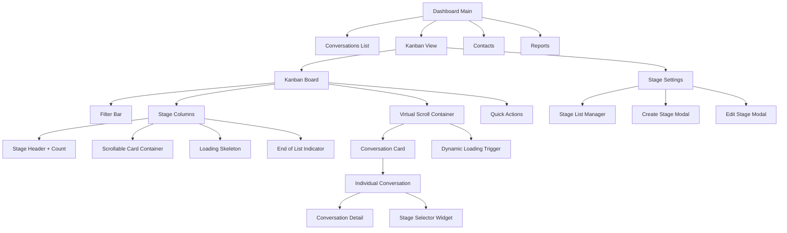
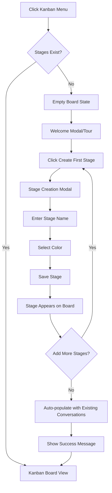
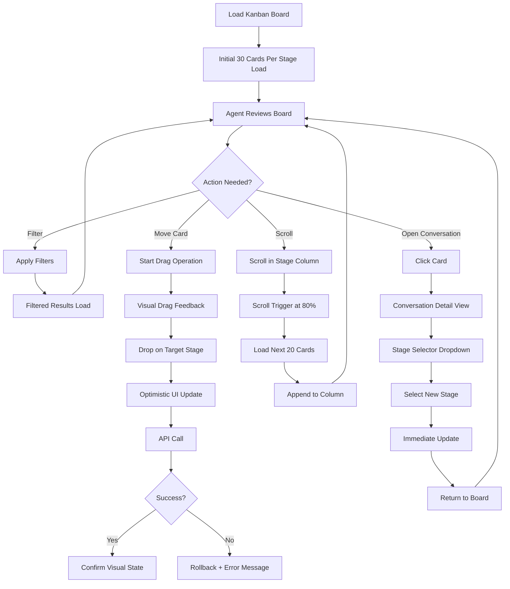
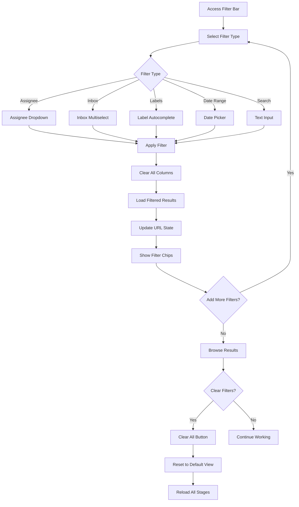

# Chatwoot Kanban UI/UX Specification

## Introduction

This document defines the user experience goals, information architecture, user flows, and visual design specifications for Chatwoot's new Kanban interface. It serves as the foundation for visual design and frontend development, ensuring a cohesive and user-centered experience that seamlessly integrates with the existing Chatwoot ecosystem.

### Overall UX Goals & Principles

#### Target User Personas

**Support Agents**: Front-line staff who need efficient conversation management and visual workflow clarity. They require immediate visual feedback and fast task completion.

**Team Leads/Supervisors**: Managers who need overview of team performance and conversation flow. They focus on team coordination and process optimization.

**Account Administrators**: Users who configure and customize workflow stages for their organization. They need powerful configuration tools with clear guidance.

#### Usability Goals

- **Visual Clarity**: Agents can instantly understand conversation status and next actions
- **Efficient Workflow**: Drag-and-drop operations complete in <200ms with clear feedback  
- **Quick Stage Changes**: Stage updates possible within conversation view without navigation
- **Filter Efficiency**: Multiple filters can be applied/removed quickly without page reload
- **Mobile Accessibility**: Core functions work on tablet/mobile for remote agents

#### Design Principles

1. **Clarity over cleverness** - Prioritize clear communication over aesthetic innovation
2. **Progressive disclosure** - Show only what's needed, when it's needed
3. **Consistent patterns** - Use familiar UI patterns throughout the application
4. **Immediate feedback** - Every action should have a clear, immediate response
5. **Accessible by default** - Design for all users from the start

### Change Log

| Date | Version | Description | Author |
|------|---------|-------------|---------|
| 2025-01-15 | 1.0 | Initial UI/UX specification for Kanban system | UX Team |

## Information Architecture (IA)

### Site Map / Screen Inventory

### Navigation Structure

**Primary Navigation**: New "Kanban" menu item positioned between "Conversations" and "Contacts" in main sidebar, using consistent iconography (board/grid icon from existing icon set)

**Secondary Navigation**: Within Kanban section - toggle between "Board View" and "Settings", breadcrumb showing current filter state

**Breadcrumb Strategy**: Dashboard → Kanban → [Active Filters Summary] for board view; Dashboard → Kanban → Settings → [Current Action] for configuration

**Dynamic Loading Architecture**:
- **Initial Load**: Load first 20-30 cards per stage
- **Scroll Trigger**: When user reaches 80% of column scroll
- **Batch Size**: Load 15-20 additional cards per request
- **Visual Feedback**: Skeleton cards during loading
- **Performance**: Virtual scrolling for stages with 100+ conversations

## User Flows

### Flow 1: First-Time Kanban Setup

**User Goal**: Administrator wants to set up Kanban stages for their team for the first time

**Entry Points**: 
- Main nav "Kanban" menu item (new users)
- Dashboard notification/banner about new feature

**Success Criteria**: User has created 3-5 meaningful stages and can see conversations organized by stage

**Flow Diagram**:

**Edge Cases & Error Handling**:
- Stage name already exists → Show inline error with suggestions
- Maximum stages reached (20) → Disable add button with tooltip explanation
- Network error during creation → Show retry option with draft preservation
- No conversations exist → Show empty state with guidance

### Flow 2: Daily Conversation Management (Core Workflow)

**User Goal**: Support agent wants to move conversations through workflow stages during daily work

**Entry Points**:
- Direct navigation to Kanban board
- From individual conversation view

**Success Criteria**: Agent successfully moves conversations between stages with immediate visual feedback

**Flow Diagram**:

**Edge Cases & Error Handling**:
- Drag operation interrupted by network → Rollback with clear error message
- Concurrent stage changes by other users → Show conflict resolution options
- Loading failure during scroll → Retry button with preserved scroll position
- Stage deleted while user viewing → Graceful redirect with explanation

### Flow 3: Advanced Filtering and Search

**User Goal**: User wants to find specific conversations using multiple filter criteria

**Entry Points**:
- Filter bar on Kanban board
- Search input field

**Success Criteria**: User finds target conversations quickly with intuitive filter combinations

**Flow Diagram**:

**Edge Cases & Error Handling**:
- No results found → Show empty state with suggestion to adjust filters
- Filter combination too restrictive → Progressive disclosure of constraint messages
- Filter state in URL malformed → Reset to default with notification
- Real-time updates conflict with filters → Smart merge or user choice

## Wireframes & Mockups

### Key Screen Layouts

#### Kanban Board - Main View

**Purpose**: Primary workspace where agents manage conversation workflow through visual stage organization

**Key Elements**:
- **Header Bar**: Filters (Inbox, Assignee, Labels, Date Range, Search) with active filter chips
- **Stage Columns**: Horizontally scrollable columns with stage name, color indicator, and conversation count
- **Conversation Cards**: Compact cards showing contact name, subject preview, assignee avatar, labels, and last activity timestamp
- **Loading States**: Skeleton cards at bottom of columns during infinite scroll
- **Action Toolbar**: Quick actions (refresh, settings, view toggle) aligned with existing Chatwoot patterns

**Interaction Notes**: 
- Drag handles appear on hover for cards
- Column width auto-adjusts based on content but maintains minimum 280px
- Horizontal scroll for stages when they exceed viewport width
- Smooth scroll-snap behavior for stage navigation

#### Stage Configuration Settings

**Purpose**: Administrative interface for creating, editing, and organizing workflow stages

**Key Elements**:
- **Stage List**: Sortable list showing existing stages with drag handles for reordering
- **Stage Cards**: Each showing name, color swatch, conversation count, and edit/delete actions
- **Create Stage Modal**: Form with name input, color picker (predefined palette + custom), and position selector
- **Validation Messages**: Inline feedback for naming conflicts and limits
- **Bulk Actions**: Select multiple stages for batch operations

**Interaction Notes**:
- Color picker uses Chatwoot's existing color palette as primary options
- Drag-to-reorder with visual feedback and drop zones
- Delete confirmation with impact warning (number of affected conversations)
- Auto-save draft state for interrupted creation process

#### Conversation Card Component

**Purpose**: Compact, scannable representation of conversation state within Kanban columns

**Key Elements**:
- **Header**: Contact name (truncated) + conversation status indicator
- **Content Preview**: Subject line or last message snippet (2 lines max)
- **Metadata Strip**: Assignee avatar, priority indicator, label chips (max 3 visible)
- **Footer**: Relative timestamp + unread message count if applicable
- **Drag Handle**: Subtle grip pattern visible on hover/focus

**Interaction Notes**:
- Click anywhere on card opens conversation detail
- Hover reveals additional metadata tooltip
- Focus state clearly visible for keyboard navigation
- Smooth transform animations during drag operations

#### In-Conversation Stage Selector

**Purpose**: Contextual stage modification without leaving conversation detail view

**Key Elements**:
- **Current Stage Indicator**: Prominent display of current stage with color coding
- **Stage Dropdown**: List of all available stages with color indicators and names
- **Quick Change Actions**: Recently used stages as quick-access buttons
- **Change History**: Recent stage transitions in conversation timeline
- **Validation Feedback**: Success/error states for stage changes

**Interaction Notes**:
- Dropdown positioned to avoid blocking conversation content
- Immediate visual feedback with loading state during API call
- Stage change logged in conversation history with timestamp and user
- Keyboard shortcut support (numbers 1-9 for first 9 stages)

#### Mobile Responsive Layout

**Purpose**: Optimized Kanban experience for tablet and mobile devices

**Key Elements**:
- **Simplified Filter Bar**: Collapsible with modal overlay for complex filters
- **Single Column View**: One stage at a time with swipe navigation between stages
- **Optimized Cards**: Larger touch targets, simplified metadata display
- **Stage Navigator**: Bottom tab bar showing stage names and counts
- **Touch Gestures**: Swipe to change stage, long-press for card actions

**Interaction Notes**:
- Stage switching via horizontal swipe or bottom navigator tabs
- Card drag-and-drop replaced with tap-to-select + stage navigator
- Optimized for one-handed operation with thumb-friendly zones
- Progressive enhancement from desktop to mobile patterns

## Component Library / Design System

**Design System Approach**: Utilizar exclusivamente o design system existente do Chatwoot com Tailwind CSS. Todos os novos componentes seguirão padrões estabelecidos em `components-next/`.

### Core Components

#### KanbanBoard
**Purpose**: Container principal do sistema Kanban
**Variants**: Full-width, filtered view, mobile single-column
**States**: Loading, loaded, empty, error
**Usage Guidelines**: Usar grid system existente, manter spacing consistency

#### KanbanColumn  
**Purpose**: Coluna individual representando uma fase
**Variants**: Default, collapsed, overflow
**States**: Normal, loading-more, drag-over
**Usage Guidelines**: Min-width 280px, scrollable content area

#### ConversationCard
**Purpose**: Card individual de conversa
**Variants**: Default, compact, priority-highlighted
**States**: Default, hover, dragging, selected
**Usage Guidelines**: Seguir card patterns existentes do Chatwoot

#### StageSelector
**Purpose**: Dropdown para seleção de fase
**Variants**: Inline, modal, quick-select
**States**: Default, loading, error, disabled
**Usage Guidelines**: Integrar com formulários existentes, manter accessibility

## Branding & Style Guide

### Visual Identity
**Brand Guidelines**: Seguir guidelines existentes do Chatwoot - usar cores, tipografia e iconografia já estabelecidas

### Color Palette
| Color Type | Usage | Notes |
|------------|-------|-------|
| Primary | Stage headers, action buttons | From existing Chatwoot palette |
| Secondary | Card borders, metadata | Consistent with current theme |
| Success | Completed stages, positive feedback | Existing success color |
| Warning | Attention needed stages | Existing warning color |
| Error | Error states, validation | Existing error color |
| Neutral | Text, backgrounds, borders | Current neutral palette |

### Typography
**Font Families**:
- **Primary**: Current Chatwoot font stack
- **Monospace**: For timestamps and IDs

**Type Scale**: Follow existing Chatwoot typography scale for consistency

### Iconography
**Icon Library**: Usar biblioteca de ícones existente (Heroicons/Tabler)
**Usage Guidelines**: Manter consistência com ícones já utilizados no sistema

### Spacing & Layout
**Grid System**: Utilizar grid system atual do Chatwoot
**Spacing Scale**: Seguir escala de spacing definida no Tailwind config

## Accessibility Requirements

### Compliance Target
**Standard**: WCAG 2.1 AA (seguindo padrão atual do Chatwoot)

### Key Requirements

**Visual**:
- Color contrast ratios: 4.5:1 mínimo para texto normal, 3:1 para texto grande
- Focus indicators: Visível border/outline em todos elementos interativos
- Text sizing: Responsivo até 200% zoom sem scroll horizontal

**Interaction**:
- Keyboard navigation: Tab order lógico, todas funções acessíveis via teclado
- Screen reader support: ARIA labels, semantic HTML, live regions para updates
- Touch targets: Mínimo 44px para elementos touch em mobile

**Content**:
- Alternative text: Alt text para todos elementos visuais informativos
- Heading structure: Hierarquia semântica clara (h1 → h2 → h3)
- Form labels: Labels explícitas para todos inputs e controles

### Testing Strategy
Integrar testes de acessibilidade no pipeline de desenvolvimento usando ferramentas como axe-core e testes manuais com screen readers

## Responsiveness Strategy

### Breakpoints
| Breakpoint | Min Width | Max Width | Target Devices | Adaptations |
|------------|-----------|-----------|----------------|-------------|
| Mobile | 0px | 767px | Smartphones | Single column, swipe navigation |
| Tablet | 768px | 1023px | Tablets | 2-3 columns, simplified drag & drop |
| Desktop | 1024px | 1439px | Laptops/Desktops | Full functionality, all columns |
| Wide | 1440px | - | Large screens | Optimized spacing, more columns visible |

### Adaptation Patterns

**Layout Changes**: 
- Mobile: Single column with stage selector tabs
- Tablet: Reduced columns with horizontal scroll
- Desktop: Full grid layout with all features

**Navigation Changes**:
- Mobile: Bottom tab navigation for stages
- Tablet: Simplified top navigation
- Desktop: Full sidebar + breadcrumb navigation

**Content Priority**:
- Mobile: Essential info only, progressive disclosure
- Tablet: Balanced information density
- Desktop: Full metadata display

**Interaction Changes**:
- Mobile: Touch gestures, simplified drag & drop
- Tablet: Hybrid touch/mouse interactions
- Desktop: Full drag & drop, keyboard shortcuts

## Animation & Micro-interactions

### Motion Principles
Transições sutis que fornecem feedback imediato sem prejudicar performance. Seguir princípios de Material Design para movimento natural.

### Key Animations
- **Card Drag**: Transform scale (0.95) + shadow elevation durante drag (200ms, ease-out)
- **Column Scroll**: Smooth scroll behavior com scroll-behavior: smooth
- **Loading States**: Skeleton pulse animation (1.5s loop, subtle opacity changes)
- **Stage Transitions**: Fade in/out para mudanças de estado (150ms, ease-in-out)
- **Filter Application**: Stagger animation para cards aparecendo (50ms delay between items)
- **Error States**: Subtle shake animation para validação (300ms, 3 cycles)

## Performance Considerations

### Performance Goals
- **Initial Load**: <1s para board inicial (30 cards/stage)
- **Scroll Loading**: <300ms para novos cards aparecerem
- **Drag Response**: <100ms para início do drag operation
- **Filter Application**: <500ms para aplicar filtros complexos

### Design Strategies
- Virtual scrolling para listas grandes
- Lazy loading de imagens e avatars
- Debounced search e filtros
- Optimistic UI updates para operações críticas
- Skeleton screens durante loading states
- Progressive image loading com placeholders

## Next Steps

### Immediate Actions
1. **Review stakeholder approval** desta especificação UI/UX
2. **Create technical architecture document** baseado nesta spec
3. **Begin component development** seguindo ordem das user stories do PRD
4. **Setup development environment** para Kanban feature
5. **Create component library** extensions no Figma/design system

### Design Handoff Checklist
- ✅ All user flows documented
- ✅ Component inventory complete  
- ✅ Accessibility requirements defined
- ✅ Responsive strategy clear
- ✅ Brand guidelines incorporated
- ✅ Performance goals established
- ✅ Animation specifications defined
- ✅ Error states and edge cases covered

---

**Generated with [Claude Code](https://claude.ai/code)**

**Co-Authored-By: Claude <noreply@anthropic.com>**