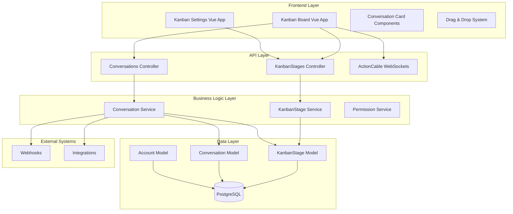
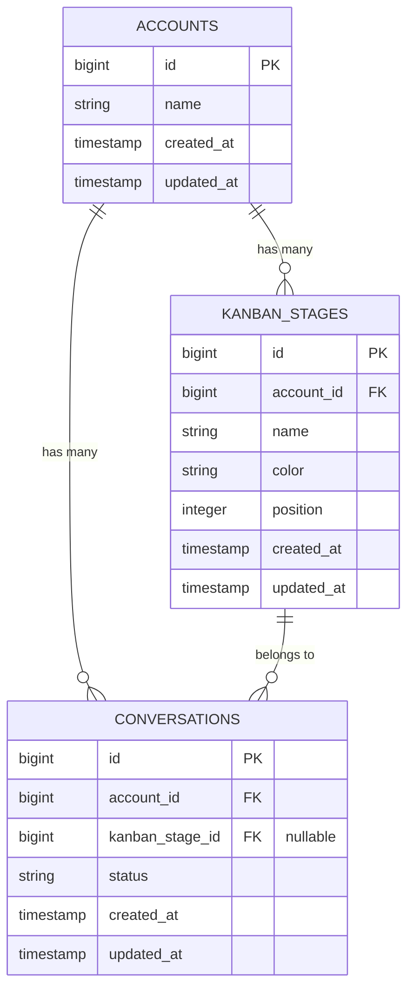
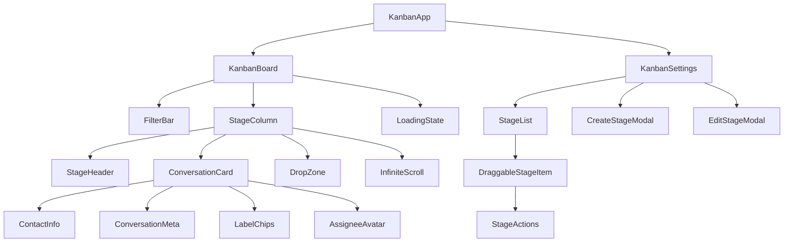

# Chatwoot Kanban System - Full-Stack Architecture

## Executive Summary

This document defines the complete technical architecture for implementing a Kanban-based conversation management system within Chatwoot. The system enables visual workflow management through customizable stages, drag-and-drop interactions, and comprehensive filtering capabilities while maintaining full backward compatibility with existing features.

**Key Architecture Decisions:**
- **Brownfield Integration**: Extends existing conversation system without breaking changes
- **Progressive Enhancement**: Kanban as an additional view layer over existing data
- **Real-time Synchronization**: Leverages ActionCable for multi-user collaboration
- **Performance-First**: Virtual scrolling and optimistic UI updates for responsive experience

---

## System Overview

### High-Level Architecture



### Core Architectural Principles

1. **Domain-Driven Design**: Kanban stages as first-class domain entities
2. **Event-Driven Architecture**: Real-time updates via ActionCable events
3. **CQRS Pattern**: Separate read/write operations for performance
4. **Progressive Web App**: Responsive, mobile-first interface design
5. **Defense in Depth**: Multi-layer security and validation

---

## Data Architecture

### Database Schema Design

#### New Table: `kanban_stages`

```sql
CREATE TABLE kanban_stages (
    id BIGSERIAL PRIMARY KEY,
    account_id BIGINT NOT NULL,
    name VARCHAR(255) NOT NULL,
    color VARCHAR(7) NOT NULL DEFAULT '#6366f1',
    position INTEGER NOT NULL,
    created_at TIMESTAMP NOT NULL,
    updated_at TIMESTAMP NOT NULL,
    
    CONSTRAINT fk_kanban_stages_account
        FOREIGN KEY (account_id) REFERENCES accounts(id)
        ON DELETE CASCADE,
    
    CONSTRAINT unique_stage_name_per_account
        UNIQUE (account_id, name),
    
    CONSTRAINT unique_stage_position_per_account
        UNIQUE (account_id, position),
        
    CONSTRAINT valid_color_format
        CHECK (color ~ '^#[0-9A-Fa-f]{6}$')
);

-- Performance indexes
CREATE INDEX idx_kanban_stages_account_position 
    ON kanban_stages (account_id, position);
CREATE INDEX idx_kanban_stages_account_id 
    ON kanban_stages (account_id);
```

#### Modified Table: `conversations`

```sql
-- Add kanban_stage_id as optional foreign key
ALTER TABLE conversations 
ADD COLUMN kanban_stage_id BIGINT NULL,
ADD CONSTRAINT fk_conversations_kanban_stage
    FOREIGN KEY (kanban_stage_id) REFERENCES kanban_stages(id)
    ON DELETE SET NULL;

-- Performance index for Kanban queries
CREATE INDEX idx_conversations_account_kanban_stage 
    ON conversations (account_id, kanban_stage_id);
CREATE INDEX idx_conversations_kanban_stage_updated 
    ON conversations (kanban_stage_id, updated_at DESC);
```

### Data Relationships



### Migration Strategy

```ruby
# db/migrate/20250115_create_kanban_stages.rb
class CreateKanbanStages < ActiveRecord::Migration[7.1]
  def up
    create_table :kanban_stages do |t|
      t.references :account, null: false, foreign_key: { on_delete: :cascade }
      t.string :name, null: false, limit: 255
      t.string :color, null: false, default: '#6366f1', limit: 7
      t.integer :position, null: false
      t.timestamps null: false
      
      t.index [:account_id, :name], unique: true
      t.index [:account_id, :position], unique: true
      t.index [:account_id, :position], name: 'idx_kanban_stages_account_position'
    end
    
    add_column :conversations, :kanban_stage_id, :bigint, null: true
    add_foreign_key :conversations, :kanban_stages, on_delete: :nullify
    add_index :conversations, [:account_id, :kanban_stage_id]
    add_index :conversations, [:kanban_stage_id, :updated_at]
    
    # Create default stages for existing accounts
    create_default_stages_for_existing_accounts
  end
  
  def down
    remove_foreign_key :conversations, :kanban_stages
    remove_column :conversations, :kanban_stage_id
    drop_table :kanban_stages
  end
  
  private
  
  def create_default_stages_for_existing_accounts
    Account.find_each do |account|
      %w[New In\ Progress Review Resolved].each_with_index do |name, index|
        account.kanban_stages.create!(
          name: name,
          color: default_colors[index],
          position: index + 1
        )
      end
    end
  end
  
  def default_colors
    %w[#3b82f6 #f59e0b #10b981 #6366f1]
  end
end
```

---

## Backend Architecture

### Model Layer

#### KanbanStage Model

```ruby
# app/models/kanban_stage.rb
class KanbanStage < ApplicationRecord
  belongs_to :account
  has_many :conversations, dependent: :nullify
  
  validates :name, presence: true, length: { maximum: 255 }
  validates :name, uniqueness: { scope: :account_id }
  validates :color, presence: true, format: { with: /\A#[0-9A-Fa-f]{6}\z/ }
  validates :position, presence: true, uniqueness: { scope: :account_id }
  validates :position, numericality: { greater_than: 0, less_than_or_equal_to: 20 }
  
  scope :ordered, -> { order(:position) }
  scope :for_account, ->(account) { where(account: account) }
  
  before_validation :set_next_position, if: :new_record?
  after_create :broadcast_stage_created
  after_update :broadcast_stage_updated
  after_destroy :broadcast_stage_destroyed
  
  def conversations_count
    conversations.count
  end
  
  def move_to_position!(new_position)
    transaction do
      if new_position < position
        # Moving up: shift others down
        account.kanban_stages
               .where(position: new_position...position)
               .update_all('position = position + 1')
      else
        # Moving down: shift others up
        account.kanban_stages
               .where(position: (position + 1)..new_position)
               .update_all('position = position - 1')
      end
      
      update!(position: new_position)
    end
  end
  
  private
  
  def set_next_position
    self.position ||= account.kanban_stages.maximum(:position).to_i + 1
  end
  
  def broadcast_stage_created
    ActionCable.server.broadcast(
      "account_#{account_id}_kanban",
      { type: 'stage_created', stage: KanbanStageSerializer.new(self).serializable_hash }
    )
  end
  
  def broadcast_stage_updated
    ActionCable.server.broadcast(
      "account_#{account_id}_kanban",
      { type: 'stage_updated', stage: KanbanStageSerializer.new(self).serializable_hash }
    )
  end
  
  def broadcast_stage_destroyed
    ActionCable.server.broadcast(
      "account_#{account_id}_kanban",
      { type: 'stage_destroyed', stage_id: id }
    )
  end
end
```

#### Extended Conversation Model

```ruby
# app/models/conversation.rb (additions)
class Conversation < ApplicationRecord
  # ... existing code ...
  
  belongs_to :kanban_stage, optional: true
  
  scope :in_kanban_stage, ->(stage) { where(kanban_stage: stage) }
  scope :without_kanban_stage, -> { where(kanban_stage: nil) }
  scope :kanban_ordered, -> { order(:updated_at, :created_at) }
  
  after_update :broadcast_kanban_stage_change, if: :saved_change_to_kanban_stage_id?
  
  def move_to_stage!(stage)
    transaction do
      old_stage = kanban_stage
      update!(kanban_stage: stage)
      
      # Log the stage change
      create_activity(
        key: 'kanban_stage_changed',
        parameters: {
          old_stage: old_stage&.name,
          new_stage: stage&.name,
          changed_by: Current.user&.name
        }
      )
    end
  end
  
  private
  
  def broadcast_kanban_stage_change
    ActionCable.server.broadcast(
      "account_#{account_id}_kanban",
      {
        type: 'conversation_stage_changed',
        conversation_id: id,
        old_stage_id: kanban_stage_id_before_last_save,
        new_stage_id: kanban_stage_id,
        conversation: ConversationSerializer.new(self).serializable_hash
      }
    )
  end
end
```

### Controller Layer

#### KanbanStages Controller

```ruby
# app/controllers/api/v1/kanban_stages_controller.rb
class Api::V1::KanbanStagesController < Api::V1::BaseController
  before_action :check_authorization
  before_action :set_kanban_stage, only: [:show, :update, :destroy]
  
  def index
    @kanban_stages = Current.account.kanban_stages.ordered.includes(:conversations)
    render json: KanbanStageSerializer.new(@kanban_stages, include_conversations_count: true)
  end
  
  def show
    render json: KanbanStageSerializer.new(@kanban_stage)
  end
  
  def create
    @kanban_stage = Current.account.kanban_stages.build(kanban_stage_params)
    
    if @kanban_stage.save
      render json: KanbanStageSerializer.new(@kanban_stage), status: :created
    else
      render json: { errors: @kanban_stage.errors }, status: :unprocessable_entity
    end
  end
  
  def update
    if @kanban_stage.update(kanban_stage_params)
      render json: KanbanStageSerializer.new(@kanban_stage)
    else
      render json: { errors: @kanban_stage.errors }, status: :unprocessable_entity
    end
  end
  
  def destroy
    conversations_count = @kanban_stage.conversations_count
    
    if conversations_count > 0
      render json: { 
        error: 'Cannot delete stage with conversations',
        conversations_count: conversations_count 
      }, status: :unprocessable_entity
    else
      @kanban_stage.destroy
      head :no_content
    end
  end
  
  def reorder
    position_updates = params[:positions] # Array of {id: 1, position: 2}
    
    KanbanStage.transaction do
      position_updates.each do |update|
        stage = Current.account.kanban_stages.find(update[:id])
        stage.move_to_position!(update[:position])
      end
    end
    
    render json: { success: true }
  rescue ActiveRecord::RecordNotFound
    render json: { error: 'Stage not found' }, status: :not_found
  rescue StandardError => e
    render json: { error: e.message }, status: :unprocessable_entity
  end
  
  private
  
  def set_kanban_stage
    @kanban_stage = Current.account.kanban_stages.find(params[:id])
  end
  
  def kanban_stage_params
    params.require(:kanban_stage).permit(:name, :color, :position)
  end
  
  def check_authorization
    authorize(KanbanStage)
  end
end
```

#### Extended Conversations Controller

```ruby
# app/controllers/api/v1/conversations_controller.rb (additions)
class Api::V1::ConversationsController < Api::V1::BaseController
  # ... existing actions ...
  
  def update_kanban_stage
    @conversation = Current.account.conversations.find(params[:id])
    authorize @conversation, :update?
    
    if params[:kanban_stage_id].present?
      stage = Current.account.kanban_stages.find(params[:kanban_stage_id])
      @conversation.move_to_stage!(stage)
    else
      @conversation.move_to_stage!(nil)
    end
    
    render json: ConversationSerializer.new(@conversation)
  rescue ActiveRecord::RecordNotFound
    render json: { error: 'Stage not found' }, status: :not_found
  rescue StandardError => e
    render json: { error: e.message }, status: :unprocessable_entity
  end
  
  def kanban_board
    stages = Current.account.kanban_stages.ordered.includes(:conversations)
    conversations_by_stage = {}
    
    stages.each do |stage|
      conversations_by_stage[stage.id] = paginated_conversations_for_stage(stage)
    end
    
    # Include conversations without stage
    conversations_by_stage['unassigned'] = paginated_conversations_for_stage(nil)
    
    render json: {
      stages: KanbanStageSerializer.new(stages),
      conversations_by_stage: conversations_by_stage,
      meta: pagination_meta
    }
  end
  
  private
  
  def paginated_conversations_for_stage(stage)
    conversations = if stage
                     stage.conversations
                   else
                     Current.account.conversations.without_kanban_stage
                   end
    
    # Apply existing filters (inbox, assignee, status, etc.)
    conversations = apply_filters(conversations)
    
    # Paginate
    conversations = conversations.kanban_ordered
                                .limit(params[:limit] || 30)
                                .offset(params[:offset] || 0)
    
    ConversationSerializer.new(conversations, include_associations: true)
  end
end
```

### Service Layer

```ruby
# app/services/kanban_stage_service.rb
class KanbanStageService
  include Service::Base
  
  def self.create_default_stages_for_account(account)
    stages_data = [
      { name: 'New', color: '#3b82f6', position: 1 },
      { name: 'In Progress', color: '#f59e0b', position: 2 },
      { name: 'Review', color: '#10b981', position: 3 },
      { name: 'Resolved', color: '#6366f1', position: 4 }
    ]
    
    stages_data.map do |stage_data|
      account.kanban_stages.create!(stage_data)
    end
  end
  
  def self.bulk_move_conversations(conversation_ids, target_stage, current_user)
    conversations = Conversation.where(id: conversation_ids)
    
    Conversation.transaction do
      conversations.each do |conversation|
        next unless Pundit.policy(current_user, conversation).update?
        
        conversation.move_to_stage!(target_stage)
      end
    end
    
    conversations.reload
  end
  
  def self.migrate_conversations_from_deleted_stage(stage)
    default_stage = stage.account.kanban_stages.ordered.first
    
    stage.conversations.update_all(kanban_stage_id: default_stage&.id)
  end
end
```

### Policy Layer

```ruby
# app/policies/kanban_stage_policy.rb
class KanbanStagePolicy < ApplicationPolicy
  def index?
    @user.administrator? || @user.agent?
  end
  
  def show?
    index?
  end
  
  def create?
    @user.administrator?
  end
  
  def update?
    @user.administrator?
  end
  
  def destroy?
    @user.administrator?
  end
  
  def reorder?
    @user.administrator?
  end
  
  class Scope < Scope
    def resolve
      if user.administrator?
        scope.all
      else
        scope.none
      end
    end
  end
end
```

---

## Frontend Architecture

### Component Hierarchy



### Vue.js Architecture

#### Main Kanban Board Component

```vue
<!-- app/javascript/dashboard/routes/dashboard/kanban/KanbanBoard.vue -->
<template>
  <div class="kanban-board-container h-full flex flex-col">
    <!-- Filter Bar -->
    <KanbanFilterBar
      v-model:filters="activeFilters"
      :loading="isLoading"
      @filter-change="handleFilterChange"
      @clear-filters="clearAllFilters"
    />
    
    <!-- Board Content -->
    <div class="kanban-board flex-1 overflow-hidden">
      <div 
        class="stage-columns-container h-full overflow-x-auto overflow-y-hidden"
        @scroll="handleHorizontalScroll"
      >
        <div class="stages-wrapper flex h-full gap-4 p-4 min-w-max">
          <!-- Stage Columns -->
          <KanbanStageColumn
            v-for="stage in stages"
            :key="stage.id"
            :stage="stage"
            :conversations="conversationsByStage[stage.id] || []"
            :loading="loadingStages.includes(stage.id)"
            @load-more="loadMoreConversations"
            @conversation-drop="handleConversationDrop"
            @conversation-click="openConversation"
          />
          
          <!-- Unassigned Column -->
          <KanbanStageColumn
            :stage="unassignedStage"
            :conversations="conversationsByStage.unassigned || []"
            :loading="loadingStages.includes('unassigned')"
            @load-more="loadMoreConversations"
            @conversation-drop="handleConversationDrop"
            @conversation-click="openConversation"
          />
        </div>
      </div>
    </div>
    
    <!-- Loading Overlay -->
    <LoadingOverlay v-if="isInitialLoading" />
  </div>
</template>

<script setup>
import { ref, computed, onMounted, watch } from 'vue'
import { useStore } from 'vuex'
import { useRoute, useRouter } from 'vue-router'
import { useDragAndDrop } from '@/composables/useDragAndDrop'
import { useInfiniteScroll } from '@/composables/useInfiniteScroll'
import { useFilters } from '@/composables/useFilters'

const store = useStore()
const route = useRoute()
const router = useRouter()

// Reactive state
const isInitialLoading = ref(true)
const isLoading = ref(false)
const loadingStages = ref([])
const activeFilters = ref({})

// Computed properties
const stages = computed(() => store.getters['kanban/getStages'])
const conversationsByStage = computed(() => store.getters['kanban/getConversationsByStage'])
const account = computed(() => store.getters['accounts/getAccount'])

const unassignedStage = computed(() => ({
  id: 'unassigned',
  name: 'Unassigned',
  color: '#6b7280',
  position: 999
}))

// Composables
const { filters, applyFilters, clearFilters } = useFilters()
const { 
  dragState, 
  startDrag, 
  handleDrop 
} = useDragAndDrop()

// Lifecycle
onMounted(async () => {
  await initializeKanbanBoard()
  isInitialLoading.value = false
})

// Watchers
watch(
  () => route.query,
  (newQuery) => {
    applyFiltersFromQuery(newQuery)
  },
  { immediate: true }
)

// Methods
async function initializeKanbanBoard() {
  try {
    // Load stages and initial conversations
    await Promise.all([
      store.dispatch('kanban/fetchStages'),
      store.dispatch('kanban/fetchConversations', { 
        filters: activeFilters.value,
        reset: true 
      })
    ])
    
    // Subscribe to real-time updates
    subscribeToKanbanUpdates()
  } catch (error) {
    console.error('Failed to initialize Kanban board:', error)
    // Show error toast
  }
}

async function handleFilterChange(newFilters) {
  activeFilters.value = newFilters
  isLoading.value = true
  
  try {
    await store.dispatch('kanban/fetchConversations', {
      filters: newFilters,
      reset: true
    })
    
    // Update URL query params
    updateUrlWithFilters(newFilters)
  } catch (error) {
    console.error('Filter application failed:', error)
  } finally {
    isLoading.value = false
  }
}

async function loadMoreConversations(stageId) {
  if (loadingStages.value.includes(stageId)) return
  
  loadingStages.value.push(stageId)
  
  try {
    await store.dispatch('kanban/fetchMoreConversations', {
      stageId,
      filters: activeFilters.value
    })
  } catch (error) {
    console.error('Failed to load more conversations:', error)
  } finally {
    loadingStages.value = loadingStages.value.filter(id => id !== stageId)
  }
}

async function handleConversationDrop({ conversationId, targetStageId, sourceStageId }) {
  if (targetStageId === sourceStageId) return
  
  try {
    // Optimistic update
    store.commit('kanban/moveConversationOptimistic', {
      conversationId,
      targetStageId,
      sourceStageId
    })
    
    // API call
    await store.dispatch('kanban/updateConversationStage', {
      conversationId,
      stageId: targetStageId === 'unassigned' ? null : targetStageId
    })
  } catch (error) {
    // Rollback optimistic update
    store.commit('kanban/rollbackConversationMove', {
      conversationId,
      targetStageId: sourceStageId,
      sourceStageId: targetStageId
    })
    
    console.error('Failed to move conversation:', error)
    // Show error toast
  }
}

function openConversation(conversationId) {
  router.push({
    name: 'conversation_through_kanban',
    params: { conversation_id: conversationId },
    query: { ...route.query, from: 'kanban' }
  })
}

function subscribeToKanbanUpdates() {
  // ActionCable subscription for real-time updates
  store.dispatch('kanban/subscribeToUpdates', {
    accountId: account.value.id
  })
}
</script>

<style scoped>
.kanban-board-container {
  @apply bg-slate-50;
}

.stage-columns-container {
  scroll-behavior: smooth;
}

.stages-wrapper {
  min-width: fit-content;
}

/* Drag and drop styles */
.conversation-card.dragging {
  @apply opacity-50 transform scale-95;
}

.stage-column.drag-over {
  @apply bg-blue-50 border-blue-300;
}
</style>
```

#### Stage Column Component

```vue
<!-- app/javascript/dashboard/routes/dashboard/kanban/components/KanbanStageColumn.vue -->
<template>
  <div 
    class="stage-column"
    :class="{ 'drag-over': isDragOver }"
    @drop="handleDrop"
    @dragover.prevent="handleDragOver"
    @dragleave="handleDragLeave"
  >
    <!-- Stage Header -->
    <div class="stage-header">
      <div class="flex items-center gap-2">
        <div 
          class="stage-color-indicator"
          :style="{ backgroundColor: stage.color }"
        />
        <h3 class="stage-title">{{ stage.name }}</h3>
        <span class="conversation-count">{{ conversations.length }}</span>
      </div>
      
      <StageActions
        v-if="stage.id !== 'unassigned'"
        :stage="stage"
        @edit="$emit('edit-stage', stage)"
        @delete="$emit('delete-stage', stage)"
      />
    </div>
    
    <!-- Conversations List -->
    <div 
      ref="conversationsList"
      class="conversations-list"
      @scroll="handleScroll"
    >
      <div class="conversations-container">
        <!-- Conversation Cards -->
        <ConversationCard
          v-for="conversation in conversations"
          :key="conversation.id"
          :conversation="conversation"
          :stage="stage"
          draggable="true"
          @dragstart="handleDragStart"
          @click="$emit('conversation-click', conversation.id)"
        />
        
        <!-- Loading Skeletons -->
        <ConversationCardSkeleton
          v-if="loading"
          v-for="n in 3"
          :key="`skeleton-${n}`"
        />
        
        <!-- Empty State -->
        <div 
          v-if="!loading && conversations.length === 0"
          class="empty-stage-state"
        >
          <div class="empty-state-icon">
            <Icon name="inbox" size="24" />
          </div>
          <p class="empty-state-text">No conversations in this stage</p>
        </div>
      </div>
    </div>
  </div>
</template>

<script setup>
import { ref, computed } from 'vue'
import { useInfiniteScroll } from '@/composables/useInfiniteScroll'

const props = defineProps({
  stage: {
    type: Object,
    required: true
  },
  conversations: {
    type: Array,
    default: () => []
  },
  loading: {
    type: Boolean,
    default: false
  }
})

const emit = defineEmits([
  'load-more',
  'conversation-drop',
  'conversation-click',
  'edit-stage',
  'delete-stage'
])

// Refs
const conversationsList = ref(null)
const isDragOver = ref(false)

// Composables
const { isNearBottom } = useInfiniteScroll(conversationsList, {
  threshold: 100,
  onLoadMore: () => emit('load-more', props.stage.id)
})

// Methods
function handleDragStart(event) {
  const conversationId = event.target.dataset.conversationId
  event.dataTransfer.setData('text/plain', conversationId)
  event.dataTransfer.setData('application/json', JSON.stringify({
    conversationId,
    sourceStageId: props.stage.id
  }))
}

function handleDrop(event) {
  event.preventDefault()
  isDragOver.value = false
  
  try {
    const data = JSON.parse(event.dataTransfer.getData('application/json'))
    
    emit('conversation-drop', {
      ...data,
      targetStageId: props.stage.id
    })
  } catch (error) {
    console.error('Failed to parse drop data:', error)
  }
}

function handleDragOver(event) {
  event.preventDefault()
  isDragOver.value = true
}

function handleDragLeave() {
  isDragOver.value = false
}

function handleScroll() {
  if (isNearBottom.value && !props.loading) {
    emit('load-more', props.stage.id)
  }
}
</script>

<style scoped>
.stage-column {
  @apply w-80 bg-white rounded-lg shadow-sm border border-gray-200 flex flex-col;
  min-width: 320px;
  max-width: 400px;
  height: calc(100vh - 180px);
}

.stage-column.drag-over {
  @apply border-blue-400 bg-blue-50;
}

.stage-header {
  @apply p-4 border-b border-gray-200 flex items-center justify-between;
}

.stage-color-indicator {
  @apply w-3 h-3 rounded-full;
}

.stage-title {
  @apply text-sm font-medium text-gray-900;
}

.conversation-count {
  @apply text-xs bg-gray-100 text-gray-600 px-2 py-1 rounded-full;
}

.conversations-list {
  @apply flex-1 overflow-y-auto p-2;
}

.conversations-container {
  @apply space-y-2;
}

.empty-stage-state {
  @apply flex flex-col items-center justify-center py-8 text-gray-500;
}

.empty-state-icon {
  @apply mb-3 text-gray-400;
}

.empty-state-text {
  @apply text-sm;
}
</style>
```

### Vuex Store Architecture

```javascript
// app/javascript/dashboard/store/modules/kanban.js
import { kanbanAPI } from '../../api/kanban'
import types from '../mutation-types'

const state = {
  stages: [],
  conversationsByStage: {},
  filters: {},
  loading: {
    stages: false,
    conversations: false,
    stageOperations: false
  },
  pagination: {},
  subscription: null
}

const getters = {
  getStages: state => state.stages,
  getStageById: state => id => state.stages.find(stage => stage.id === id),
  getConversationsByStage: state => state.conversationsByStage,
  getConversationsForStage: state => stageId => state.conversationsByStage[stageId] || [],
  isLoading: state => state.loading,
  getFilters: state => state.filters,
  getPagination: state => state.pagination
}

const actions = {
  async fetchStages({ commit }) {
    commit(types.SET_KANBAN_LOADING, { type: 'stages', loading: true })
    
    try {
      const response = await kanbanAPI.getStages()
      commit(types.SET_KANBAN_STAGES, response.data)
      return response.data
    } catch (error) {
      throw error
    } finally {
      commit(types.SET_KANBAN_LOADING, { type: 'stages', loading: false })
    }
  },

  async fetchConversations({ commit, state }, { filters = {}, reset = false }) {
    commit(types.SET_KANBAN_LOADING, { type: 'conversations', loading: true })
    
    try {
      const response = await kanbanAPI.getKanbanBoard({
        ...filters,
        offset: reset ? 0 : state.pagination.offset || 0,
        limit: 30
      })
      
      if (reset) {
        commit(types.SET_KANBAN_CONVERSATIONS, response.data.conversations_by_stage)
      } else {
        commit(types.APPEND_KANBAN_CONVERSATIONS, response.data.conversations_by_stage)
      }
      
      commit(types.SET_KANBAN_PAGINATION, response.data.meta)
      commit(types.SET_KANBAN_FILTERS, filters)
      
      return response.data
    } catch (error) {
      throw error
    } finally {
      commit(types.SET_KANBAN_LOADING, { type: 'conversations', loading: false })
    }
  },

  async updateConversationStage({ commit }, { conversationId, stageId }) {
    try {
      const response = await kanbanAPI.updateConversationStage(conversationId, stageId)
      commit(types.UPDATE_CONVERSATION_STAGE_SUCCESS, {
        conversationId,
        stageId,
        conversation: response.data
      })
      return response.data
    } catch (error) {
      throw error
    }
  },

  async createStage({ commit }, stageData) {
    commit(types.SET_KANBAN_LOADING, { type: 'stageOperations', loading: true })
    
    try {
      const response = await kanbanAPI.createStage(stageData)
      commit(types.ADD_KANBAN_STAGE, response.data)
      return response.data
    } catch (error) {
      throw error
    } finally {
      commit(types.SET_KANBAN_LOADING, { type: 'stageOperations', loading: false })
    }
  },

  async updateStage({ commit }, { stageId, stageData }) {
    try {
      const response = await kanbanAPI.updateStage(stageId, stageData)
      commit(types.UPDATE_KANBAN_STAGE, response.data)
      return response.data
    } catch (error) {
      throw error
    }
  },

  async deleteStage({ commit }, stageId) {
    try {
      await kanbanAPI.deleteStage(stageId)
      commit(types.REMOVE_KANBAN_STAGE, stageId)
    } catch (error) {
      throw error
    }
  },

  async reorderStages({ commit }, positions) {
    try {
      await kanbanAPI.reorderStages(positions)
      commit(types.REORDER_KANBAN_STAGES, positions)
    } catch (error) {
      throw error
    }
  },

  subscribeToUpdates({ commit, state }, { accountId }) {
    if (state.subscription) {
      state.subscription.unsubscribe()
    }

    const subscription = App.cable.subscriptions.create(
      { channel: 'KanbanChannel', account_id: accountId },
      {
        received(data) {
          switch (data.type) {
            case 'stage_created':
              commit(types.ADD_KANBAN_STAGE, data.stage)
              break
            case 'stage_updated':
              commit(types.UPDATE_KANBAN_STAGE, data.stage)
              break
            case 'stage_destroyed':
              commit(types.REMOVE_KANBAN_STAGE, data.stage_id)
              break
            case 'conversation_stage_changed':
              commit(types.MOVE_CONVERSATION_BETWEEN_STAGES, {
                conversationId: data.conversation_id,
                oldStageId: data.old_stage_id,
                newStageId: data.new_stage_id,
                conversation: data.conversation
              })
              break
          }
        }
      }
    )

    commit(types.SET_KANBAN_SUBSCRIPTION, subscription)
  }
}

const mutations = {
  [types.SET_KANBAN_STAGES](state, stages) {
    state.stages = stages
  },

  [types.ADD_KANBAN_STAGE](state, stage) {
    state.stages.push(stage)
    state.stages.sort((a, b) => a.position - b.position)
  },

  [types.UPDATE_KANBAN_STAGE](state, updatedStage) {
    const index = state.stages.findIndex(stage => stage.id === updatedStage.id)
    if (index !== -1) {
      state.stages.splice(index, 1, updatedStage)
    }
  },

  [types.REMOVE_KANBAN_STAGE](state, stageId) {
    state.stages = state.stages.filter(stage => stage.id !== stageId)
    delete state.conversationsByStage[stageId]
  },

  [types.SET_KANBAN_CONVERSATIONS](state, conversationsByStage) {
    state.conversationsByStage = conversationsByStage
  },

  [types.APPEND_KANBAN_CONVERSATIONS](state, conversationsByStage) {
    Object.keys(conversationsByStage).forEach(stageId => {
      if (state.conversationsByStage[stageId]) {
        state.conversationsByStage[stageId].push(...conversationsByStage[stageId])
      } else {
        state.conversationsByStage[stageId] = conversationsByStage[stageId]
      }
    })
  },

  [types.MOVE_CONVERSATION_OPTIMISTIC](state, { conversationId, targetStageId, sourceStageId }) {
    const sourceConversations = state.conversationsByStage[sourceStageId] || []
    const conversation = sourceConversations.find(c => c.id === conversationId)
    
    if (conversation) {
      // Remove from source
      state.conversationsByStage[sourceStageId] = sourceConversations.filter(c => c.id !== conversationId)
      
      // Add to target
      if (!state.conversationsByStage[targetStageId]) {
        state.conversationsByStage[targetStageId] = []
      }
      state.conversationsByStage[targetStageId].unshift(conversation)
    }
  },

  [types.SET_KANBAN_LOADING](state, { type, loading }) {
    state.loading[type] = loading
  },

  [types.SET_KANBAN_FILTERS](state, filters) {
    state.filters = filters
  },

  [types.SET_KANBAN_PAGINATION](state, pagination) {
    state.pagination = pagination
  },

  [types.SET_KANBAN_SUBSCRIPTION](state, subscription) {
    state.subscription = subscription
  }
}

export default {
  namespaced: true,
  state,
  getters,
  actions,
  mutations
}
```

### API Client Layer

```javascript
// app/javascript/dashboard/api/kanban.js
import ApiClient from './ApiClient'

class KanbanAPI extends ApiClient {
  constructor() {
    super('kanban_stages', { accountScoped: true })
  }

  getStages() {
    return axios.get(this.url)
  }

  createStage(stageData) {
    return axios.post(this.url, { kanban_stage: stageData })
  }

  updateStage(stageId, stageData) {
    return axios.patch(`${this.url}/${stageId}`, { kanban_stage: stageData })
  }

  deleteStage(stageId) {
    return axios.delete(`${this.url}/${stageId}`)
  }

  reorderStages(positions) {
    return axios.patch(`${this.url}/reorder`, { positions })
  }

  getKanbanBoard(params = {}) {
    return axios.get(`${this.accountUrl}/conversations/kanban_board`, { params })
  }

  updateConversationStage(conversationId, stageId) {
    return axios.patch(
      `${this.accountUrl}/conversations/${conversationId}/kanban_stage`,
      { kanban_stage_id: stageId }
    )
  }
}

export const kanbanAPI = new KanbanAPI()
```

---

## Real-time Architecture

### ActionCable Integration

#### Kanban Channel

```ruby
# app/channels/kanban_channel.rb
class KanbanChannel < ApplicationCable::Channel
  def subscribed
    ensure_confirmation_sent
    
    # Verify account access
    account = Account.find(params[:account_id])
    authorize account, :show?
    
    stream_from "account_#{account.id}_kanban"
  end

  def unsubscribed
    # Cleanup when channel is unsubscribed
  end

  private

  def authorize(record, action)
    policy = Pundit.policy(current_user, record)
    raise Pundit::NotAuthorizedError unless policy.public_send(action)
  end
end
```

#### Real-time Event Broadcasting

```ruby
# app/models/concerns/kanban_broadcastable.rb
module KanbanBroadcastable
  extend ActiveSupport::Concern

  included do
    after_commit :broadcast_kanban_change, on: [:create, :update, :destroy]
  end

  private

  def broadcast_kanban_change
    return unless saved_changes.any? || destroyed?
    
    ActionCable.server.broadcast(
      kanban_channel_name,
      kanban_broadcast_data
    )
  end

  def kanban_channel_name
    "account_#{account_id}_kanban"
  end

  def kanban_broadcast_data
    {
      type: kanban_event_type,
      model: self.class.name.underscore,
      id: id,
      data: kanban_serialized_data
    }
  end

  def kanban_event_type
    case
    when destroyed? then 'destroyed'
    when previously_new_record? then 'created'
    else 'updated'
    end
  end

  def kanban_serialized_data
    # Override in including models
    {}
  end
end
```

### WebSocket Event Handling

```javascript
// app/javascript/dashboard/composables/useKanbanRealtime.js
import { ref, onMounted, onUnmounted } from 'vue'
import { useStore } from 'vuex'

export function useKanbanRealtime(accountId) {
  const store = useStore()
  const isConnected = ref(false)
  const connectionError = ref(null)
  let subscription = null

  function connect() {
    if (subscription) {
      subscription.unsubscribe()
    }

    subscription = App.cable.subscriptions.create(
      { 
        channel: 'KanbanChannel', 
        account_id: accountId 
      },
      {
        connected() {
          isConnected.value = true
          connectionError.value = null
          console.log('Connected to Kanban channel')
        },

        disconnected() {
          isConnected.value = false
          console.log('Disconnected from Kanban channel')
        },

        received(data) {
          handleRealtimeEvent(data)
        },

        rejected() {
          connectionError.value = 'Connection rejected'
          console.error('Kanban channel connection rejected')
        }
      }
    )
  }

  function handleRealtimeEvent(data) {
    switch (data.type) {
      case 'stage_created':
        store.commit('kanban/ADD_KANBAN_STAGE', data.stage)
        break
        
      case 'stage_updated':
        store.commit('kanban/UPDATE_KANBAN_STAGE', data.stage)
        break
        
      case 'stage_destroyed':
        store.commit('kanban/REMOVE_KANBAN_STAGE', data.stage_id)
        break
        
      case 'conversation_stage_changed':
        store.commit('kanban/MOVE_CONVERSATION_BETWEEN_STAGES', {
          conversationId: data.conversation_id,
          oldStageId: data.old_stage_id,
          newStageId: data.new_stage_id,
          conversation: data.conversation
        })
        break
        
      case 'conversation_updated':
        store.commit('kanban/UPDATE_CONVERSATION_IN_STAGE', {
          conversation: data.conversation
        })
        break
        
      default:
        console.warn('Unknown realtime event type:', data.type)
    }
  }

  function disconnect() {
    if (subscription) {
      subscription.unsubscribe()
      subscription = null
    }
    isConnected.value = false
  }

  onMounted(() => {
    connect()
  })

  onUnmounted(() => {
    disconnect()
  })

  return {
    isConnected,
    connectionError,
    connect,
    disconnect
  }
}
```

---

## Security Architecture

### Authentication & Authorization

#### Policy-Based Access Control

```ruby
# app/policies/kanban_stage_policy.rb
class KanbanStagePolicy < ApplicationPolicy
  class Scope < Scope
    def resolve
      # Users can only see stages from their account
      scope.where(account: user.account)
    end
  end

  def index?
    user.agent? || user.administrator?
  end

  def show?
    index? && record.account == user.account
  end

  def create?
    user.administrator? && can_manage_account?
  end

  def update?
    user.administrator? && record.account == user.account
  end

  def destroy?
    update? && !record.has_conversations?
  end

  def reorder?
    update?
  end

  private

  def can_manage_account?
    user.account == Account.find(context[:account_id])
  end
end
```

#### Input Validation & Sanitization

```ruby
# app/controllers/concerns/kanban_security.rb
module KanbanSecurity
  extend ActiveSupport::Concern

  private

  def sanitize_kanban_stage_params
    params.require(:kanban_stage).permit(:name, :color, :position).tap do |stage_params|
      # Sanitize name
      stage_params[:name] = ActionController::Base.helpers.sanitize(
        stage_params[:name],
        tags: [],
        attributes: []
      ).strip.truncate(255)

      # Validate color format
      stage_params[:color] = validate_color_format(stage_params[:color])

      # Validate position
      stage_params[:position] = validate_position(stage_params[:position])
    end
  end

  def validate_color_format(color)
    return '#6366f1' unless color.is_a?(String)
    
    # Remove any non-hex characters and ensure proper format
    cleaned_color = color.gsub(/[^#0-9A-Fa-f]/, '')
    cleaned_color = "##{cleaned_color}" unless cleaned_color.start_with?('#')
    
    # Validate hex format
    if cleaned_color.match?(/\A#[0-9A-Fa-f]{6}\z/)
      cleaned_color
    else
      '#6366f1' # Default color
    end
  end

  def validate_position(position)
    pos = position.to_i
    pos.clamp(1, 20) # Limit to reasonable range
  end

  def validate_conversation_ownership(conversation)
    unless conversation.account == Current.account
      raise Pundit::NotAuthorizedError, 'Conversation does not belong to current account'
    end
  end

  def validate_stage_ownership(stage)
    unless stage.account == Current.account
      raise Pundit::NotAuthorizedError, 'Stage does not belong to current account'
    end
  end
end
```

#### Rate Limiting

```ruby
# config/initializers/rack_attack.rb (additions)
Rack::Attack.throttle('kanban_stage_operations/account/hour', limit: 100, period: 1.hour) do |req|
  if req.path.match?(%r{/api/v1/accounts/\d+/kanban_stages}) && req.post?
    account_id = req.path.match(%r{/accounts/(\d+)/})[1]
    "kanban_stage_operations:#{account_id}"
  end
end

Rack::Attack.throttle('kanban_stage_updates/user/minute', limit: 30, period: 1.minute) do |req|
  if req.path.match?(%r{/kanban_stage}) && (req.patch? || req.put?)
    req.ip
  end
end

Rack::Attack.throttle('conversation_stage_updates/user/minute', limit: 60, period: 1.minute) do |req|
  if req.path.match?(%r{/conversations/\d+/kanban_stage}) && req.patch?
    req.ip
  end
end
```

### Data Privacy & Compliance

#### GDPR Compliance Additions

```ruby
# app/models/kanban_stage.rb (additions)
class KanbanStage < ApplicationRecord
  # ... existing code ...
  
  # GDPR compliance
  def self.anonymize_for_account(account)
    account.kanban_stages.update_all(
      name: 'Anonymized Stage',
      updated_at: Time.current
    )
  end

  def anonymize!
    update!(
      name: "Stage #{id}",
      updated_at: Time.current
    )
  end
end
```

#### Audit Logging

```ruby
# app/models/concerns/kanban_auditable.rb
module KanbanAuditable
  extend ActiveSupport::Concern

  included do
    has_many :audit_logs, as: :auditable, dependent: :destroy
    
    after_create :log_creation
    after_update :log_update
    after_destroy :log_destruction
  end

  private

  def log_creation
    create_audit_log('created', changes_for_audit)
  end

  def log_update
    return unless saved_changes.any?
    create_audit_log('updated', changes_for_audit)
  end

  def log_destruction
    create_audit_log('destroyed', attributes_for_audit)
  end

  def create_audit_log(action, data)
    audit_logs.create!(
      action: action,
      user: Current.user,
      account: account,
      changes: data,
      ip_address: Current.ip_address,
      user_agent: Current.user_agent
    )
  end

  def changes_for_audit
    saved_changes.except('updated_at', 'created_at')
  end

  def attributes_for_audit
    attributes.except('created_at', 'updated_at')
  end
end
```

---

## Performance Architecture

### Database Optimization

#### Indexing Strategy

```sql
-- Core performance indexes
CREATE INDEX CONCURRENTLY idx_conversations_kanban_board 
    ON conversations (account_id, kanban_stage_id, updated_at DESC);

CREATE INDEX CONCURRENTLY idx_conversations_kanban_filters 
    ON conversations (account_id, kanban_stage_id, status, assignee_id, created_at);

CREATE INDEX CONCURRENTLY idx_kanban_stages_ordered 
    ON kanban_stages (account_id, position);

-- Composite indexes for common queries
CREATE INDEX CONCURRENTLY idx_conversations_kanban_search 
    ON conversations USING gin(to_tsvector('english', subject || ' ' || content));

CREATE INDEX CONCURRENTLY idx_conversations_kanban_labels 
    ON conversations USING gin(label_list);
```

#### Query Optimization

```ruby
# app/models/concerns/kanban_queryable.rb
module KanbanQueryable
  extend ActiveSupport::Concern

  class_methods do
    def kanban_board_data(account, filters = {})
      # Optimized query to load all kanban data in minimal queries
      stages = account.kanban_stages.ordered.includes(:conversations)
      
      base_query = account.conversations
                         .includes(:contact, :assignee, :inbox, :labels)
                         .kanban_ordered

      # Apply filters efficiently
      base_query = apply_kanban_filters(base_query, filters)

      # Group conversations by stage
      conversations_by_stage = base_query.group_by(&:kanban_stage_id)
      
      # Add unassigned conversations
      unassigned = conversations_by_stage.delete(nil) || []
      conversations_by_stage['unassigned'] = unassigned

      {
        stages: stages,
        conversations_by_stage: conversations_by_stage,
        total_count: base_query.count
      }
    end

    def apply_kanban_filters(query, filters)
      query = query.where(inbox_id: filters[:inbox_ids]) if filters[:inbox_ids].present?
      query = query.where(assignee_id: filters[:assignee_ids]) if filters[:assignee_ids].present?
      query = query.where(status: filters[:statuses]) if filters[:statuses].present?
      
      if filters[:label_ids].present?
        query = query.joins(:label_taggings)
                    .where(label_taggings: { tag_id: filters[:label_ids] })
      end
      
      if filters[:created_after].present?
        query = query.where('created_at >= ?', filters[:created_after])
      end
      
      if filters[:created_before].present?
        query = query.where('created_at <= ?', filters[:created_before])
      end
      
      if filters[:search].present?
        query = query.where(
          "to_tsvector('english', subject || ' ' || COALESCE(content, '')) @@ plainto_tsquery(?)",
          filters[:search]
        )
      end

      query
    end
  end
end
```

### Caching Strategy

#### Redis Caching

```ruby
# app/services/kanban_cache_service.rb
class KanbanCacheService
  include Service::Base
  
  CACHE_PREFIX = 'kanban'
  DEFAULT_TTL = 15.minutes

  class << self
    def cache_kanban_board(account, filters = {})
      cache_key = board_cache_key(account.id, filters)
      
      Rails.cache.fetch(cache_key, expires_in: DEFAULT_TTL) do
        Conversation.kanban_board_data(account, filters)
      end
    end

    def invalidate_account_cache(account_id)
      pattern = "#{CACHE_PREFIX}:board:#{account_id}:*"
      Redis.current.keys(pattern).each { |key| Redis.current.del(key) }
    end

    def invalidate_stage_cache(stage)
      invalidate_account_cache(stage.account_id)
    end

    def cache_stage_conversations(stage, filters = {})
      cache_key = stage_conversations_key(stage.id, filters)
      
      Rails.cache.fetch(cache_key, expires_in: DEFAULT_TTL) do
        stage.conversations
             .includes(:contact, :assignee, :labels)
             .kanban_ordered
             .limit(50)
             .map { |c| ConversationSerializer.new(c).serializable_hash }
      end
    end

    private

    def board_cache_key(account_id, filters)
      filter_hash = Digest::MD5.hexdigest(filters.to_json)
      "#{CACHE_PREFIX}:board:#{account_id}:#{filter_hash}"
    end

    def stage_conversations_key(stage_id, filters)
      filter_hash = Digest::MD5.hexdigest(filters.to_json)
      "#{CACHE_PREFIX}:stage:#{stage_id}:conversations:#{filter_hash}"
    end
  end
end
```

#### Cache Invalidation

```ruby
# app/models/concerns/kanban_cache_invalidation.rb
module KanbanCacheInvalidation
  extend ActiveSupport::Concern

  included do
    after_commit :invalidate_kanban_cache
  end

  private

  def invalidate_kanban_cache
    case self.class.name
    when 'KanbanStage'
      KanbanCacheService.invalidate_stage_cache(self)
    when 'Conversation'
      if saved_change_to_kanban_stage_id?
        # Invalidate both old and new stage caches
        [kanban_stage_id_before_last_save, kanban_stage_id].compact.each do |stage_id|
          next unless stage_id
          stage = KanbanStage.find_by(id: stage_id)
          KanbanCacheService.invalidate_stage_cache(stage) if stage
        end
      end
    end
  end
end
```

### Frontend Performance

#### Virtual Scrolling Implementation

```javascript
// app/javascript/dashboard/composables/useVirtualScroll.js
import { ref, computed, onMounted, onUnmounted } from 'vue'

export function useVirtualScroll(items, options = {}) {
  const {
    itemHeight = 120,
    containerHeight = 600,
    buffer = 5
  } = options

  const scrollTop = ref(0)
  const containerRef = ref(null)

  const visibleRange = computed(() => {
    const start = Math.floor(scrollTop.value / itemHeight)
    const visibleCount = Math.ceil(containerHeight / itemHeight)
    
    return {
      start: Math.max(0, start - buffer),
      end: Math.min(items.value.length, start + visibleCount + buffer)
    }
  })

  const visibleItems = computed(() => {
    return items.value.slice(visibleRange.value.start, visibleRange.value.end)
      .map((item, index) => ({
        ...item,
        index: visibleRange.value.start + index,
        top: (visibleRange.value.start + index) * itemHeight
      }))
  })

  const totalHeight = computed(() => items.value.length * itemHeight)

  const spacerBefore = computed(() => visibleRange.value.start * itemHeight)
  const spacerAfter = computed(() => 
    (items.value.length - visibleRange.value.end) * itemHeight
  )

  function handleScroll(event) {
    scrollTop.value = event.target.scrollTop
  }

  onMounted(() => {
    if (containerRef.value) {
      containerRef.value.addEventListener('scroll', handleScroll, { passive: true })
    }
  })

  onUnmounted(() => {
    if (containerRef.value) {
      containerRef.value.removeEventListener('scroll', handleScroll)
    }
  })

  return {
    containerRef,
    visibleItems,
    visibleRange,
    totalHeight,
    spacerBefore,
    spacerAfter
  }
}
```

#### Optimistic Updates

```javascript
// app/javascript/dashboard/composables/useOptimisticUpdates.js
import { ref } from 'vue'

export function useOptimisticUpdates() {
  const pendingOperations = ref(new Map())

  function applyOptimisticUpdate(operationId, updateFn, rollbackFn) {
    // Store rollback function for potential reversal
    pendingOperations.value.set(operationId, rollbackFn)
    
    // Apply optimistic update immediately
    updateFn()
    
    return {
      confirm() {
        pendingOperations.value.delete(operationId)
      },
      
      rollback() {
        const rollback = pendingOperations.value.get(operationId)
        if (rollback) {
          rollback()
          pendingOperations.value.delete(operationId)
        }
      }
    }
  }

  function rollbackAll() {
    pendingOperations.value.forEach(rollbackFn => rollbackFn())
    pendingOperations.value.clear()
  }

  return {
    applyOptimisticUpdate,
    rollbackAll,
    hasPendingOperations: computed(() => pendingOperations.value.size > 0)
  }
}
```

---

## Testing Architecture

### Backend Testing Strategy

#### Model Tests

```ruby
# spec/models/kanban_stage_spec.rb
require 'rails_helper'

RSpec.describe KanbanStage, type: :model do
  let(:account) { create(:account) }
  
  describe 'validations' do
    subject { build(:kanban_stage, account: account) }
    
    it { should validate_presence_of(:name) }
    it { should validate_presence_of(:color) }
    it { should validate_presence_of(:position) }
    
    it { should validate_uniqueness_of(:name).scoped_to(:account_id) }
    it { should validate_uniqueness_of(:position).scoped_to(:account_id) }
    
    it 'validates color format' do
      expect(subject).to allow_value('#ff0000').for(:color)
      expect(subject).to allow_value('#FF0000').for(:color)
      expect(subject).not_to allow_value('red').for(:color)
      expect(subject).not_to allow_value('#xyz123').for(:color)
    end
    
    it 'validates position range' do
      expect(subject).to allow_value(1).for(:position)
      expect(subject).to allow_value(20).for(:position)
      expect(subject).not_to allow_value(0).for(:position)
      expect(subject).not_to allow_value(21).for(:position)
    end
  end
  
  describe 'associations' do
    it { should belong_to(:account) }
    it { should have_many(:conversations).dependent(:nullify) }
  end
  
  describe 'scopes' do
    let!(:stage1) { create(:kanban_stage, account: account, position: 2) }
    let!(:stage2) { create(:kanban_stage, account: account, position: 1) }
    let!(:stage3) { create(:kanban_stage, account: account, position: 3) }
    
    describe '.ordered' do
      it 'returns stages ordered by position' do
        expect(KanbanStage.ordered).to eq([stage2, stage1, stage3])
      end
    end
    
    describe '.for_account' do
      let(:other_account) { create(:account) }
      let!(:other_stage) { create(:kanban_stage, account: other_account) }
      
      it 'returns only stages for the specified account' do
        expect(KanbanStage.for_account(account)).to include(stage1, stage2, stage3)
        expect(KanbanStage.for_account(account)).not_to include(other_stage)
      end
    end
  end
  
  describe '#move_to_position!' do
    let!(:stages) { create_list(:kanban_stage, 5, account: account) }
    
    context 'when moving up' do
      it 'shifts other stages down' do
        stage = stages[3] # position 4
        original_positions = stages.map(&:position)
        
        stage.move_to_position!(2)
        
        stages.each(&:reload)
        expect(stage.position).to eq(2)
        expect(stages[1].position).to eq(3) # was 2, shifted down
        expect(stages[2].position).to eq(4) # was 3, shifted down
      end
    end
    
    context 'when moving down' do
      it 'shifts other stages up' do
        stage = stages[1] # position 2
        
        stage.move_to_position!(4)
        
        stages.each(&:reload)
        expect(stage.position).to eq(4)
        expect(stages[2].position).to eq(2) # was 3, shifted up
        expect(stages[3].position).to eq(3) # was 4, shifted up
      end
    end
  end
  
  describe 'broadcasting' do
    let(:stage) { build(:kanban_stage, account: account) }
    
    it 'broadcasts stage creation' do
      expect { stage.save! }
        .to have_broadcasted_to("account_#{account.id}_kanban")
        .with(hash_including(type: 'stage_created'))
    end
    
    it 'broadcasts stage updates' do
      stage.save!
      
      expect { stage.update!(name: 'Updated Name') }
        .to have_broadcasted_to("account_#{account.id}_kanban")
        .with(hash_including(type: 'stage_updated'))
    end
    
    it 'broadcasts stage destruction' do
      stage.save!
      
      expect { stage.destroy! }
        .to have_broadcasted_to("account_#{account.id}_kanban")
        .with(hash_including(type: 'stage_destroyed'))
    end
  end
end
```

#### Controller Tests

```ruby
# spec/controllers/api/v1/kanban_stages_controller_spec.rb
require 'rails_helper'

RSpec.describe Api::V1::KanbanStagesController, type: :controller do
  let(:account) { create(:account) }
  let(:user) { create(:user, :administrator, account: account) }
  let!(:stages) { create_list(:kanban_stage, 3, account: account) }
  
  before do
    allow(controller).to receive(:current_user).and_return(user)
    allow(controller).to receive(:current_account).and_return(account)
  end
  
  describe 'GET #index' do
    it 'returns all stages for the account' do
      get :index, params: { account_id: account.id }
      
      expect(response).to have_http_status(:ok)
      expect(json_response.size).to eq(3)
      expect(json_response.map { |s| s['id'] }).to match_array(stages.map(&:id))
    end
    
    it 'returns stages ordered by position' do
      stages[0].update!(position: 3)
      stages[1].update!(position: 1)
      stages[2].update!(position: 2)
      
      get :index, params: { account_id: account.id }
      
      positions = json_response.map { |s| s['position'] }
      expect(positions).to eq([1, 2, 3])
    end
  end
  
  describe 'POST #create' do
    let(:stage_params) do
      {
        name: 'New Stage',
        color: '#ff0000',
        position: 4
      }
    end
    
    context 'with valid parameters' do
      it 'creates a new stage' do
        expect {
          post :create, params: { 
            account_id: account.id, 
            kanban_stage: stage_params 
          }
        }.to change(KanbanStage, :count).by(1)
        
        expect(response).to have_http_status(:created)
        expect(json_response['name']).to eq('New Stage')
      end
      
      it 'broadcasts the stage creation' do
        expect {
          post :create, params: { 
            account_id: account.id, 
            kanban_stage: stage_params 
          }
        }.to have_broadcasted_to("account_#{account.id}_kanban")
      end
    end
    
    context 'with invalid parameters' do
      it 'returns validation errors' do
        post :create, params: { 
          account_id: account.id, 
          kanban_stage: { name: '' } 
        }
        
        expect(response).to have_http_status(:unprocessable_entity)
        expect(json_response['errors']).to include('name')
      end
    end
    
    context 'with duplicate name' do
      it 'returns validation error' do
        post :create, params: { 
          account_id: account.id, 
          kanban_stage: { name: stages.first.name } 
        }
        
        expect(response).to have_http_status(:unprocessable_entity)
        expect(json_response['errors']['name']).to include('has already been taken')
      end
    end
  end
  
  describe 'PATCH #reorder' do
    let(:positions) do
      [
        { id: stages[0].id, position: 3 },
        { id: stages[1].id, position: 1 },
        { id: stages[2].id, position: 2 }
      ]
    end
    
    it 'reorders stages successfully' do
      patch :reorder, params: { 
        account_id: account.id, 
        positions: positions 
      }
      
      expect(response).to have_http_status(:ok)
      
      stages.each(&:reload)
      expect(stages[0].position).to eq(3)
      expect(stages[1].position).to eq(1)
      expect(stages[2].position).to eq(2)
    end
    
    it 'returns error for invalid stage ID' do
      positions[0][:id] = 999999
      
      patch :reorder, params: { 
        account_id: account.id, 
        positions: positions 
      }
      
      expect(response).to have_http_status(:not_found)
    end
  end
  
  describe 'authorization' do
    context 'when user is not administrator' do
      let(:agent_user) { create(:user, :agent, account: account) }
      
      before do
        allow(controller).to receive(:current_user).and_return(agent_user)
      end
      
      it 'denies create access' do
        post :create, params: { 
          account_id: account.id, 
          kanban_stage: { name: 'Test' } 
        }
        
        expect(response).to have_http_status(:forbidden)
      end
    end
  end
end
```

### Frontend Testing Strategy

#### Component Tests

```javascript
// app/javascript/dashboard/routes/dashboard/kanban/KanbanBoard.spec.js
import { mount } from '@vue/test-utils'
import { createStore } from 'vuex'
import KanbanBoard from './KanbanBoard.vue'
import kanbanModule from '../../../store/modules/kanban'

describe('KanbanBoard', () => {
  let store
  let wrapper

  const mockStages = [
    { id: 1, name: 'New', color: '#3b82f6', position: 1 },
    { id: 2, name: 'In Progress', color: '#f59e0b', position: 2 },
    { id: 3, name: 'Resolved', color: '#10b981', position: 3 }
  ]

  const mockConversations = {
    1: [
      { id: 1, subject: 'Test Conversation 1', contact: { name: 'John Doe' } },
      { id: 2, subject: 'Test Conversation 2', contact: { name: 'Jane Smith' } }
    ],
    2: [
      { id: 3, subject: 'Test Conversation 3', contact: { name: 'Bob Wilson' } }
    ],
    3: [],
    unassigned: [
      { id: 4, subject: 'Unassigned Conversation', contact: { name: 'Alice Brown' } }
    ]
  }

  beforeEach(() => {
    store = createStore({
      modules: {
        kanban: {
          ...kanbanModule,
          state: {
            ...kanbanModule.state,
            stages: mockStages,
            conversationsByStage: mockConversations
          }
        },
        accounts: {
          namespaced: true,
          getters: {
            getAccount: () => ({ id: 1, name: 'Test Account' })
          }
        }
      }
    })

    wrapper = mount(KanbanBoard, {
      global: {
        plugins: [store],
        mocks: {
          $route: { query: {} },
          $router: { push: jest.fn() }
        },
        stubs: {
          KanbanFilterBar: true,
          KanbanStageColumn: true,
          LoadingOverlay: true
        }
      }
    })
  })

  afterEach(() => {
    wrapper.unmount()
  })

  describe('initialization', () => {
    it('renders the kanban board container', () => {
      expect(wrapper.find('.kanban-board-container').exists()).toBe(true)
    })

    it('renders stage columns for each stage', () => {
      const stageColumns = wrapper.findAllComponents({ name: 'KanbanStageColumn' })
      expect(stageColumns).toHaveLength(4) // 3 stages + unassigned
    })

    it('renders filter bar', () => {
      expect(wrapper.findComponent({ name: 'KanbanFilterBar' }).exists()).toBe(true)
    })
  })

  describe('filter functionality', () => {
    it('updates active filters when filter changes', async () => {
      const filterBar = wrapper.findComponent({ name: 'KanbanFilterBar' })
      const newFilters = { assignee_id: 1, status: 'open' }

      await filterBar.vm.$emit('filter-change', newFilters)

      expect(wrapper.vm.activeFilters).toEqual(newFilters)
    })

    it('dispatches fetch conversations action when filters change', async () => {
      const dispatchSpy = jest.spyOn(store, 'dispatch')
      const filterBar = wrapper.findComponent({ name: 'KanbanFilterBar' })

      await filterBar.vm.$emit('filter-change', { status: 'open' })

      expect(dispatchSpy).toHaveBeenCalledWith('kanban/fetchConversations', {
        filters: { status: 'open' },
        reset: true
      })
    })
  })

  describe('drag and drop', () => {
    it('handles conversation drop between stages', async () => {
      const dispatchSpy = jest.spyOn(store, 'dispatch')
      const commitSpy = jest.spyOn(store, 'commit')
      
      const stageColumn = wrapper.findAllComponents({ name: 'KanbanStageColumn' })[0]

      await stageColumn.vm.$emit('conversation-drop', {
        conversationId: 1,
        targetStageId: 2,
        sourceStageId: 1
      })

      // Check optimistic update
      expect(commitSpy).toHaveBeenCalledWith('kanban/moveConversationOptimistic', {
        conversationId: 1,
        targetStageId: 2,
        sourceStageId: 1
      })

      // Check API call
      expect(dispatchSpy).toHaveBeenCalledWith('kanban/updateConversationStage', {
        conversationId: 1,
        stageId: 2
      })
    })

    it('does not handle drop when source and target are the same', async () => {
      const dispatchSpy = jest.spyOn(store, 'dispatch')
      const stageColumn = wrapper.findAllComponents({ name: 'KanbanStageColumn' })[0]

      await stageColumn.vm.$emit('conversation-drop', {
        conversationId: 1,
        targetStageId: 1,
        sourceStageId: 1
      })

      expect(dispatchSpy).not.toHaveBeenCalledWith('kanban/updateConversationStage', expect.anything())
    })
  })

  describe('infinite scrolling', () => {
    it('loads more conversations when load-more is emitted', async () => {
      const dispatchSpy = jest.spyOn(store, 'dispatch')
      const stageColumn = wrapper.findAllComponents({ name: 'KanbanStageColumn' })[0]

      await stageColumn.vm.$emit('load-more', 1)

      expect(dispatchSpy).toHaveBeenCalledWith('kanban/fetchMoreConversations', {
        stageId: 1,
        filters: expect.any(Object)
      })
    })

    it('does not load more if stage is already loading', async () => {
      wrapper.vm.loadingStages.push(1)
      
      const dispatchSpy = jest.spyOn(store, 'dispatch')
      const stageColumn = wrapper.findAllComponents({ name: 'KanbanStageColumn' })[0]

      await stageColumn.vm.$emit('load-more', 1)

      expect(dispatchSpy).not.toHaveBeenCalledWith('kanban/fetchMoreConversations', expect.anything())
    })
  })

  describe('error handling', () => {
    it('shows error state when fetch fails', async () => {
      const consoleErrorSpy = jest.spyOn(console, 'error').mockImplementation()
      jest.spyOn(store, 'dispatch').mockRejectedValue(new Error('Network error'))

      await wrapper.vm.handleFilterChange({ status: 'open' })

      expect(consoleErrorSpy).toHaveBeenCalledWith('Filter application failed:', expect.any(Error))
    })

    it('rolls back optimistic update on API failure', async () => {
      const commitSpy = jest.spyOn(store, 'commit')
      jest.spyOn(store, 'dispatch').mockRejectedValue(new Error('API error'))

      await wrapper.vm.handleConversationDrop({
        conversationId: 1,
        targetStageId: 2,
        sourceStageId: 1
      })

      expect(commitSpy).toHaveBeenCalledWith('kanban/rollbackConversationMove', {
        conversationId: 1,
        targetStageId: 1,
        sourceStageId: 2
      })
    })
  })
})
```

#### Integration Tests

```javascript
// spec/system/kanban_board_spec.js
import { test, expect } from '@playwright/test'

test.describe('Kanban Board', () => {
  test.beforeEach(async ({ page }) => {
    // Setup test data and login
    await page.goto('/app/accounts/1/dashboard/kanban')
    await page.waitForLoadState('networkidle')
  })

  test('displays stages and conversations correctly', async ({ page }) => {
    // Check stage columns are visible
    await expect(page.locator('[data-testid="stage-column"]')).toHaveCount(4)
    
    // Check stage names
    await expect(page.locator('[data-testid="stage-title"]').first()).toHaveText('New')
    
    // Check conversation cards are visible
    await expect(page.locator('[data-testid="conversation-card"]')).toHaveCount.greaterThan(0)
  })

  test('can drag and drop conversations between stages', async ({ page }) => {
    const sourceCard = page.locator('[data-testid="conversation-card"]').first()
    const targetStage = page.locator('[data-testid="stage-column"]').nth(1)

    // Get initial stage for verification
    const sourceStage = page.locator('[data-testid="stage-column"]').first()
    const initialCount = await sourceStage.locator('[data-testid="conversation-count"]').textContent()

    // Perform drag and drop
    await sourceCard.dragTo(targetStage)

    // Wait for optimistic update
    await page.waitForTimeout(500)

    // Verify the conversation moved (optimistic update)
    const newCount = await sourceStage.locator('[data-testid="conversation-count"]').textContent()
    expect(parseInt(newCount)).toBe(parseInt(initialCount) - 1)
  })

  test('can filter conversations', async ({ page }) => {
    // Open filter dropdown
    await page.click('[data-testid="filter-assignee"]')
    
    // Select an assignee
    await page.click('[data-testid="assignee-option"]')
    
    // Wait for filtered results
    await page.waitForLoadState('networkidle')
    
    // Verify filter chip is shown
    await expect(page.locator('[data-testid="filter-chip"]')).toBeVisible()
    
    // Verify conversations are filtered
    const conversationCards = page.locator('[data-testid="conversation-card"]')
    await expect(conversationCards).toHaveCount.greaterThan(0)
  })

  test('can create a new stage', async ({ page }) => {
    await page.click('[data-testid="kanban-settings-link"]')
    await page.click('[data-testid="create-stage-button"]')
    
    // Fill stage form
    await page.fill('[data-testid="stage-name-input"]', 'Testing Stage')
    await page.click('[data-testid="color-option-red"]')
    
    // Save stage
    await page.click('[data-testid="save-stage-button"]')
    
    // Wait for creation and navigation back
    await page.waitForLoadState('networkidle')
    
    // Verify new stage appears
    await expect(page.locator('[data-testid="stage-title"]').last()).toHaveText('Testing Stage')
  })

  test('shows loading states appropriately', async ({ page }) => {
    // Trigger infinite scroll
    await page.locator('[data-testid="stage-column"]').first().hover()
    await page.mouse.wheel(0, 1000)
    
    // Check loading skeleton appears
    await expect(page.locator('[data-testid="conversation-skeleton"]')).toBeVisible()
    
    // Wait for loading to complete
    await page.waitForLoadState('networkidle')
    
    // Verify skeleton is hidden
    await expect(page.locator('[data-testid="conversation-skeleton"]')).not.toBeVisible()
  })

  test('handles real-time updates', async ({ page, context }) => {
    // Open a second page to simulate another user
    const page2 = await context.newPage()
    await page2.goto('/app/accounts/1/dashboard/kanban')
    await page2.waitForLoadState('networkidle')

    // Create a new stage from page2
    await page2.click('[data-testid="kanban-settings-link"]')
    await page2.click('[data-testid="create-stage-button"]')
    await page2.fill('[data-testid="stage-name-input"]', 'Real-time Test')
    await page2.click('[data-testid="save-stage-button"]')

    // Verify the new stage appears on page1 via real-time update
    await expect(page.locator('[data-testid="stage-title"]')).toContainText('Real-time Test')
  })
})
```

---

## Deployment Architecture

### Deployment Strategy

#### Feature Flag Implementation

```ruby
# config/initializers/feature_flags.rb
class FeatureFlags
  KANBAN_ENABLED = 'kanban_enabled'
  KANBAN_REAL_TIME = 'kanban_real_time_updates'
  KANBAN_ADVANCED_FILTERS = 'kanban_advanced_filters'
  
  class << self
    def enabled?(flag_name, account = nil)
      case flag_name
      when KANBAN_ENABLED
        kanban_enabled_for_account?(account)
      when KANBAN_REAL_TIME
        kanban_enabled_for_account?(account) && real_time_enabled?
      when KANBAN_ADVANCED_FILTERS
        kanban_enabled_for_account?(account) && advanced_filters_enabled?
      else
        false
      end
    end
    
    private
    
    def kanban_enabled_for_account?(account)
      return false unless account
      
      # Check account-specific flag
      account.features_enabled&.include?('kanban') ||
        # Check global rollout percentage
        rollout_percentage_check(account.id, kanban_rollout_percentage)
    end
    
    def kanban_rollout_percentage
      Rails.application.config.kanban_rollout_percentage || 0
    end
    
    def rollout_percentage_check(account_id, percentage)
      return true if percentage >= 100
      return false if percentage <= 0
      
      (account_id % 100) < percentage
    end
    
    def real_time_enabled?
      Rails.application.config.kanban_real_time_enabled != false
    end
    
    def advanced_filters_enabled?
      Rails.application.config.kanban_advanced_filters_enabled != false
    end
  end
end
```

#### Graceful Rollout Process

```ruby
# lib/tasks/kanban_rollout.rake
namespace :kanban do
  desc 'Enable Kanban for specific accounts'
  task :enable_for_accounts, [:account_ids] => :environment do |_t, args|
    account_ids = args[:account_ids].split(',').map(&:to_i)
    
    Account.where(id: account_ids).find_each do |account|
      enable_kanban_for_account(account)
      puts "Enabled Kanban for account #{account.id} (#{account.name})"
    end
  end
  
  desc 'Set global rollout percentage'
  task :set_rollout_percentage, [:percentage] => :environment do |_t, args|
    percentage = args[:percentage].to_i.clamp(0, 100)
    
    Rails.application.config.kanban_rollout_percentage = percentage
    puts "Set Kanban rollout percentage to #{percentage}%"
  end
  
  desc 'Create default stages for accounts with Kanban enabled'
  task :create_default_stages => :environment do
    Account.joins(:kanban_stages).distinct.find_each do |account|
      next if account.kanban_stages.any?
      
      KanbanStageService.create_default_stages_for_account(account)
      puts "Created default stages for account #{account.id}"
    end
  end
  
  private
  
  def enable_kanban_for_account(account)
    features = account.features_enabled || []
    features << 'kanban' unless features.include?('kanban')
    account.update!(features_enabled: features.uniq)
    
    # Create default stages if none exist
    if account.kanban_stages.empty?
      KanbanStageService.create_default_stages_for_account(account)
    end
  end
end
```

#### Database Migration Strategy

```ruby
# db/migrate/20250115_add_kanban_feature_flag.rb
class AddKanbanFeatureFlag < ActiveRecord::Migration[7.1]
  def up
    add_column :accounts, :features_enabled, :jsonb, default: []
    add_index :accounts, :features_enabled, using: :gin
    
    # Add feature flag check to existing queries
    say_with_time "Adding feature flag infrastructure" do
      execute <<-SQL
        CREATE OR REPLACE FUNCTION account_has_feature(account_id bigint, feature_name text)
        RETURNS boolean AS $$
        BEGIN
          RETURN EXISTS (
            SELECT 1 FROM accounts 
            WHERE id = account_id 
            AND features_enabled ? feature_name
          );
        END;
        $$ LANGUAGE plpgsql STABLE;
      SQL
    end
  end
  
  def down
    execute "DROP FUNCTION IF EXISTS account_has_feature(bigint, text);"
    remove_index :accounts, :features_enabled
    remove_column :accounts, :features_enabled
  end
end
```

### Monitoring & Observability

#### Performance Monitoring

```ruby
# app/controllers/concerns/kanban_monitoring.rb
module KanbanMonitoring
  extend ActiveSupport::Concern
  
  included do
    around_action :monitor_kanban_performance, only: [:kanban_board, :update_kanban_stage]
  end
  
  private
  
  def monitor_kanban_performance
    start_time = Time.current
    
    begin
      yield
    ensure
      duration = Time.current - start_time
      
      # Log performance metrics
      Rails.logger.info({
        event: 'kanban_action_performance',
        action: action_name,
        duration_ms: (duration * 1000).round(2),
        account_id: Current.account&.id,
        user_id: Current.user&.id,
        params: sanitized_params
      }.to_json)
      
      # Send to monitoring service
      if duration > 2.seconds
        StatsD.increment('kanban.slow_request', tags: [
          "action:#{action_name}",
          "account:#{Current.account&.id}"
        ])
      end
      
      StatsD.histogram('kanban.request_duration', duration * 1000, tags: [
        "action:#{action_name}"
      ])
    end
  end
  
  def sanitized_params
    params.except(:password, :token, :auth).to_hash
  end
end
```

#### Error Tracking

```ruby
# app/services/kanban_error_tracking.rb
class KanbanErrorTracking
  include Service::Base
  
  class << self
    def track_error(error, context = {})
      error_data = {
        error_class: error.class.name,
        error_message: error.message,
        backtrace: error.backtrace&.first(10),
        context: context,
        timestamp: Time.current,
        account_id: Current.account&.id,
        user_id: Current.user&.id
      }
      
      # Log to Rails logger
      Rails.logger.error("Kanban Error: #{error_data.to_json}")
      
      # Send to error tracking service (Sentry, Bugsnag, etc.)
      if defined?(Sentry)
        Sentry.capture_exception(error, extra: context)
      end
      
      # Increment error metrics
      StatsD.increment('kanban.errors', tags: [
        "error_class:#{error.class.name}",
        "account:#{Current.account&.id}"
      ])
    end
    
    def track_performance_issue(metric, value, context = {})
      Rails.logger.warn({
        event: 'kanban_performance_issue',
        metric: metric,
        value: value,
        context: context,
        account_id: Current.account&.id
      }.to_json)
      
      StatsD.gauge("kanban.performance.#{metric}", value, tags: [
        "account:#{Current.account&.id}"
      ])
    end
  end
end
```

#### Health Checks

```ruby
# app/controllers/health/kanban_controller.rb
class Health::KanbanController < ApplicationController
  def show
    health_status = {
      database: check_database_health,
      redis: check_redis_health,
      actioncable: check_actioncable_health,
      feature_flags: check_feature_flags_health
    }
    
    overall_status = health_status.values.all? ? :healthy : :unhealthy
    
    render json: {
      status: overall_status,
      timestamp: Time.current,
      details: health_status
    }, status: overall_status == :healthy ? :ok : :service_unavailable
  end
  
  private
  
  def check_database_health
    KanbanStage.count
    true
  rescue StandardError => e
    Rails.logger.error("Kanban database health check failed: #{e.message}")
    false
  end
  
  def check_redis_health
    Redis.current.ping == 'PONG'
  rescue StandardError => e
    Rails.logger.error("Kanban Redis health check failed: #{e.message}")
    false
  end
  
  def check_actioncable_health
    ActionCable.server.pubsub.ping
    true
  rescue StandardError => e
    Rails.logger.error("Kanban ActionCable health check failed: #{e.message}")
    false
  end
  
  def check_feature_flags_health
    FeatureFlags.enabled?('kanban_enabled')
    true
  rescue StandardError => e
    Rails.logger.error("Kanban feature flags health check failed: #{e.message}")
    false
  end
end
```

---

## Next Steps & Implementation Plan

### Phase 1: Foundation (Weeks 1-2)
1. **Database Migration**: Create `kanban_stages` table and add `kanban_stage_id` to conversations
2. **Core Models**: Implement `KanbanStage` model with validations and relationships
3. **Basic API**: Create KanbanStages controller with CRUD operations
4. **Feature Flags**: Implement feature flag system for controlled rollout

### Phase 2: Core Functionality (Weeks 3-4)
1. **Frontend Foundation**: Create basic Vue components and store structure
2. **Basic Board View**: Implement kanban board with static stage columns
3. **Stage Management**: Build stage creation and editing interfaces
4. **Navigation Integration**: Add kanban menu item and routing

### Phase 3: Interaction Layer (Weeks 5-6)
1. **Drag & Drop**: Implement conversation movement between stages
2. **Real-time Updates**: Set up ActionCable integration for live updates
3. **Optimistic UI**: Add immediate feedback for user actions
4. **Error Handling**: Implement comprehensive error states and recovery

### Phase 4: Advanced Features (Weeks 7-8)
1. **Filtering System**: Build comprehensive filter functionality
2. **Infinite Scrolling**: Implement virtual scrolling for performance
3. **Mobile Optimization**: Create responsive layouts for mobile devices
4. **In-conversation Stage Selector**: Add stage selection within conversation view

### Phase 5: Performance & Polish (Weeks 9-10)
1. **Performance Optimization**: Implement caching and query optimization
2. **Testing**: Complete unit, integration, and end-to-end test coverage
3. **Documentation**: Create user guides and technical documentation
4. **Monitoring**: Set up comprehensive monitoring and alerting

### Phase 6: Rollout (Weeks 11-12)
1. **Beta Testing**: Deploy to select accounts with feature flags
2. **Performance Monitoring**: Monitor real-world usage and performance
3. **Bug Fixes**: Address issues discovered during beta testing
4. **Full Rollout**: Gradually increase rollout percentage to all accounts

---

**Architecture Document Generated with [Claude Code](https://claude.ai/code)**

**Co-Authored-By: Claude <noreply@anthropic.com>**