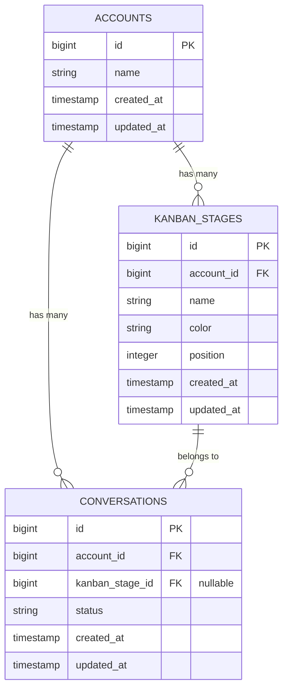

# Kanban System - Database & Migration Guide

## Overview

This guide provides the complete database implementation strategy for the Chatwoot Kanban System. This document is targeted at database administrators and backend leads responsible for implementing the data layer foundation.

**Implementation Priority:** 🔴 Critical (Week 1)  
**Dependencies:** None  
**Target Audience:** Database Team, Backend Lead

---

## Database Schema Design

### New Table: `kanban_stages`

```sql
CREATE TABLE kanban_stages (
    id BIGSERIAL PRIMARY KEY,
    account_id BIGINT NOT NULL,
    name VARCHAR(255) NOT NULL,
    color VARCHAR(7) NOT NULL DEFAULT '#6366f1',
    position INTEGER NOT NULL,
    created_at TIMESTAMP NOT NULL,
    updated_at TIMESTAMP NOT NULL,
    
    CONSTRAINT fk_kanban_stages_account
        FOREIGN KEY (account_id) REFERENCES accounts(id)
        ON DELETE CASCADE,
    
    CONSTRAINT unique_stage_name_per_account
        UNIQUE (account_id, name),
    
    CONSTRAINT unique_stage_position_per_account
        UNIQUE (account_id, position),
        
    CONSTRAINT valid_color_format
        CHECK (color ~ '^#[0-9A-Fa-f]{6}$')
);

-- Performance indexes
CREATE INDEX idx_kanban_stages_account_position 
    ON kanban_stages (account_id, position);
CREATE INDEX idx_kanban_stages_account_id 
    ON kanban_stages (account_id);
```

### Modified Table: `conversations`

```sql
-- Add kanban_stage_id as optional foreign key
ALTER TABLE conversations 
ADD COLUMN kanban_stage_id BIGINT NULL,
ADD CONSTRAINT fk_conversations_kanban_stage
    FOREIGN KEY (kanban_stage_id) REFERENCES kanban_stages(id)
    ON DELETE SET NULL;

-- Performance index for Kanban queries
CREATE INDEX idx_conversations_account_kanban_stage 
    ON conversations (account_id, kanban_stage_id);
CREATE INDEX idx_conversations_kanban_stage_updated 
    ON conversations (kanban_stage_id, updated_at DESC);
```

### Data Relationships



---

## Migration Strategy

### Primary Migration

```ruby
# db/migrate/20250115_create_kanban_stages.rb
class CreateKanbanStages < ActiveRecord::Migration[7.1]
  def up
    create_table :kanban_stages do |t|
      t.references :account, null: false, foreign_key: { on_delete: :cascade }
      t.string :name, null: false, limit: 255
      t.string :color, null: false, default: '#6366f1', limit: 7
      t.integer :position, null: false
      t.timestamps null: false
      
      t.index [:account_id, :name], unique: true
      t.index [:account_id, :position], unique: true
      t.index [:account_id, :position], name: 'idx_kanban_stages_account_position'
    end
    
    add_column :conversations, :kanban_stage_id, :bigint, null: true
    add_foreign_key :conversations, :kanban_stages, on_delete: :nullify
    add_index :conversations, [:account_id, :kanban_stage_id]
    add_index :conversations, [:kanban_stage_id, :updated_at]
    
    # Create default stages for existing accounts
    create_default_stages_for_existing_accounts
  end
  
  def down
    remove_foreign_key :conversations, :kanban_stages
    remove_column :conversations, :kanban_stage_id
    drop_table :kanban_stages
  end
  
  private
  
  def create_default_stages_for_existing_accounts
    Account.find_each do |account|
      %w[New In\ Progress Review Resolved].each_with_index do |name, index|
        account.kanban_stages.create!(
          name: name,
          color: default_colors[index],
          position: index + 1
        )
      end
    end
  end
  
  def default_colors
    %w[#3b82f6 #f59e0b #10b981 #6366f1]
  end
end
```

### Feature Flag Migration

```ruby
# db/migrate/20250115_add_kanban_feature_flag.rb
class AddKanbanFeatureFlag < ActiveRecord::Migration[7.1]
  def up
    add_column :accounts, :features_enabled, :jsonb, default: []
    add_index :accounts, :features_enabled, using: :gin
    
    # Add feature flag check to existing queries
    say_with_time "Adding feature flag infrastructure" do
      execute <<-SQL
        CREATE OR REPLACE FUNCTION account_has_feature(account_id bigint, feature_name text)
        RETURNS boolean AS $$
        BEGIN
          RETURN EXISTS (
            SELECT 1 FROM accounts 
            WHERE id = account_id 
            AND features_enabled ? feature_name
          );
        END;
        $$ LANGUAGE plpgsql STABLE;
      SQL
    end
  end
  
  def down
    execute "DROP FUNCTION IF EXISTS account_has_feature(bigint, text);"
    remove_index :accounts, :features_enabled
    remove_column :accounts, :features_enabled
  end
end
```

---

## Performance Optimization

### Core Performance Indexes

```sql
-- Core performance indexes
CREATE INDEX CONCURRENTLY idx_conversations_kanban_board 
    ON conversations (account_id, kanban_stage_id, updated_at DESC);

CREATE INDEX CONCURRENTLY idx_conversations_kanban_filters 
    ON conversations (account_id, kanban_stage_id, status, assignee_id, created_at);

CREATE INDEX CONCURRENTLY idx_kanban_stages_ordered 
    ON kanban_stages (account_id, position);

-- Composite indexes for common queries
CREATE INDEX CONCURRENTLY idx_conversations_kanban_search 
    ON conversations USING gin(to_tsvector('english', subject || ' ' || content));

CREATE INDEX CONCURRENTLY idx_conversations_kanban_labels 
    ON conversations USING gin(label_list);
```

### Query Optimization Patterns

```ruby
# app/models/concerns/kanban_queryable.rb
module KanbanQueryable
  extend ActiveSupport::Concern

  class_methods do
    def kanban_board_data(account, filters = {})
      # Optimized query to load all kanban data in minimal queries
      stages = account.kanban_stages.ordered.includes(:conversations)
      
      base_query = account.conversations
                         .includes(:contact, :assignee, :inbox, :labels)
                         .kanban_ordered

      # Apply filters efficiently
      base_query = apply_kanban_filters(base_query, filters)

      # Group conversations by stage
      conversations_by_stage = base_query.group_by(&:kanban_stage_id)
      
      # Add unassigned conversations
      unassigned = conversations_by_stage.delete(nil) || []
      conversations_by_stage['unassigned'] = unassigned

      {
        stages: stages,
        conversations_by_stage: conversations_by_stage,
        total_count: base_query.count
      }
    end

    def apply_kanban_filters(query, filters)
      query = query.where(inbox_id: filters[:inbox_ids]) if filters[:inbox_ids].present?
      query = query.where(assignee_id: filters[:assignee_ids]) if filters[:assignee_ids].present?
      query = query.where(status: filters[:statuses]) if filters[:statuses].present?
      
      if filters[:label_ids].present?
        query = query.joins(:label_taggings)
                    .where(label_taggings: { tag_id: filters[:label_ids] })
      end
      
      if filters[:created_after].present?
        query = query.where('created_at >= ?', filters[:created_after])
      end
      
      if filters[:created_before].present?
        query = query.where('created_at <= ?', filters[:created_before])
      end
      
      if filters[:search].present?
        query = query.where(
          "to_tsvector('english', subject || ' ' || COALESCE(content, '')) @@ plainto_tsquery(?)",
          filters[:search]
        )
      end

      query
    end
  end
end
```

---

## Migration Execution Plan

### Pre-Migration Checklist
- [ ] Backup production database
- [ ] Test migration on staging environment
- [ ] Verify index creation performance impact
- [ ] Confirm rollback strategy

### Execution Steps
1. **Execute main migration** during maintenance window
2. **Verify default stages creation** for all existing accounts
3. **Run performance index creation** with CONCURRENTLY flag
4. **Test basic queries** to ensure performance
5. **Enable feature flag** for initial testing accounts

### Post-Migration Validation
- [ ] Verify foreign key constraints
- [ ] Check index effectiveness with EXPLAIN ANALYZE
- [ ] Confirm default stages exist for all accounts
- [ ] Test conversation-to-stage assignment queries

### Rollback Strategy
```sql
-- Emergency rollback (if needed)
BEGIN;
  -- Remove foreign keys first
  ALTER TABLE conversations DROP CONSTRAINT fk_conversations_kanban_stage;
  
  -- Remove column
  ALTER TABLE conversations DROP COLUMN kanban_stage_id;
  
  -- Drop indexes
  DROP INDEX IF EXISTS idx_conversations_account_kanban_stage;
  DROP INDEX IF EXISTS idx_conversations_kanban_stage_updated;
  
  -- Drop table
  DROP TABLE kanban_stages;
COMMIT;
```

---

## Data Integrity Considerations

### Constraints & Validations
- **Account isolation**: All stages scoped to account_id
- **Position uniqueness**: No duplicate positions per account
- **Name uniqueness**: No duplicate stage names per account
- **Color format**: Valid hex color codes only
- **Cascade behavior**: Stage deletion nullifies conversation references

### Performance Monitoring
- Monitor query performance on conversations table post-migration
- Track index usage statistics
- Watch for lock contention during high-volume operations

---

## Next Steps

After completing this database implementation:

1. **Notify Backend Team**: Database schema ready for model implementation
2. **Share connection details**: Ensure development environments updated
3. **Performance baseline**: Establish query performance benchmarks
4. **Integration testing**: Coordinate with Backend team for model validation

**Dependencies for other shards:**
- ✅ **Shard 2 (Backend Core)**: Can begin model implementation
- ⏳ **Shard 5 (Security)**: Requires backend models for policy testing
- ⏳ **Shard 7 (Testing)**: Database fixtures and test data setup

**Related Documents:**
- [Backend Core Implementation](./02-backend-core.md)
- [Security Implementation](./05-security-implementation.md)