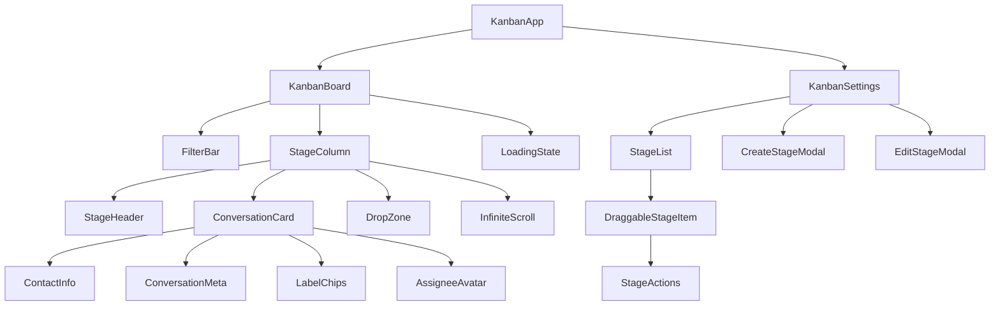

# Kanban System - Frontend Foundation & Components

## Overview

This guide provides the complete frontend implementation for the Chatwoot Kanban System. This covers Vue.js components, Vuex store architecture, and API client integration.

**Implementation Priority:** 🟡 High (Week 2-3)  
**Dependencies:** [Shard 2 - Backend Core](./02-backend-core.md)  
**Target Audience:** Frontend Development Team

---

## Component Architecture

### Component Hierarchy



---

## Core Components

### Main Kanban Board Component

```vue
<!-- app/javascript/dashboard/routes/dashboard/kanban/KanbanBoard.vue -->
<template>
  <div class="kanban-board-container h-full flex flex-col">
    <!-- Filter Bar -->
    <KanbanFilterBar
      v-model:filters="activeFilters"
      :loading="isLoading"
      @filter-change="handleFilterChange"
      @clear-filters="clearAllFilters"
    />
    
    <!-- Board Content -->
    <div class="kanban-board flex-1 overflow-hidden">
      <div 
        class="stage-columns-container h-full overflow-x-auto overflow-y-hidden"
        @scroll="handleHorizontalScroll"
      >
        <div class="stages-wrapper flex h-full gap-4 p-4 min-w-max">
          <!-- Stage Columns -->
          <KanbanStageColumn
            v-for="stage in stages"
            :key="stage.id"
            :stage="stage"
            :conversations="conversationsByStage[stage.id] || []"
            :loading="loadingStages.includes(stage.id)"
            @load-more="loadMoreConversations"
            @conversation-drop="handleConversationDrop"
            @conversation-click="openConversation"
          />
          
          <!-- Unassigned Column -->
          <KanbanStageColumn
            :stage="unassignedStage"
            :conversations="conversationsByStage.unassigned || []"
            :loading="loadingStages.includes('unassigned')"
            @load-more="loadMoreConversations"
            @conversation-drop="handleConversationDrop"
            @conversation-click="openConversation"
          />
        </div>
      </div>
    </div>
    
    <!-- Loading Overlay -->
    <LoadingOverlay v-if="isInitialLoading" />
  </div>
</template>

<script setup>
import { ref, computed, onMounted, watch } from 'vue'
import { useStore } from 'vuex'
import { useRoute, useRouter } from 'vue-router'
import { useDragAndDrop } from '@/composables/useDragAndDrop'
import { useInfiniteScroll } from '@/composables/useInfiniteScroll'
import { useFilters } from '@/composables/useFilters'

const store = useStore()
const route = useRoute()
const router = useRouter()

// Reactive state
const isInitialLoading = ref(true)
const isLoading = ref(false)
const loadingStages = ref([])
const activeFilters = ref({})

// Computed properties
const stages = computed(() => store.getters['kanban/getStages'])
const conversationsByStage = computed(() => store.getters['kanban/getConversationsByStage'])
const account = computed(() => store.getters['accounts/getAccount'])

const unassignedStage = computed(() => ({
  id: 'unassigned',
  name: 'Unassigned',
  color: '#6b7280',
  position: 999
}))

// Composables
const { filters, applyFilters, clearFilters } = useFilters()
const { 
  dragState, 
  startDrag, 
  handleDrop 
} = useDragAndDrop()

// Lifecycle
onMounted(async () => {
  await initializeKanbanBoard()
  isInitialLoading.value = false
})

// Watchers
watch(
  () => route.query,
  (newQuery) => {
    applyFiltersFromQuery(newQuery)
  },
  { immediate: true }
)

// Methods
async function initializeKanbanBoard() {
  try {
    // Load stages and initial conversations
    await Promise.all([
      store.dispatch('kanban/fetchStages'),
      store.dispatch('kanban/fetchConversations', { 
        filters: activeFilters.value,
        reset: true 
      })
    ])
    
    // Subscribe to real-time updates
    subscribeToKanbanUpdates()
  } catch (error) {
    console.error('Failed to initialize Kanban board:', error)
    // Show error toast
  }
}

async function handleFilterChange(newFilters) {
  activeFilters.value = newFilters
  isLoading.value = true
  
  try {
    await store.dispatch('kanban/fetchConversations', {
      filters: newFilters,
      reset: true
    })
    
    // Update URL query params
    updateUrlWithFilters(newFilters)
  } catch (error) {
    console.error('Filter application failed:', error)
  } finally {
    isLoading.value = false
  }
}

async function loadMoreConversations(stageId) {
  if (loadingStages.value.includes(stageId)) return
  
  loadingStages.value.push(stageId)
  
  try {
    await store.dispatch('kanban/fetchMoreConversations', {
      stageId,
      filters: activeFilters.value
    })
  } catch (error) {
    console.error('Failed to load more conversations:', error)
  } finally {
    loadingStages.value = loadingStages.value.filter(id => id !== stageId)
  }
}

async function handleConversationDrop({ conversationId, targetStageId, sourceStageId }) {
  if (targetStageId === sourceStageId) return
  
  try {
    // Optimistic update
    store.commit('kanban/moveConversationOptimistic', {
      conversationId,
      targetStageId,
      sourceStageId
    })
    
    // API call
    await store.dispatch('kanban/updateConversationStage', {
      conversationId,
      stageId: targetStageId === 'unassigned' ? null : targetStageId
    })
  } catch (error) {
    // Rollback optimistic update
    store.commit('kanban/rollbackConversationMove', {
      conversationId,
      targetStageId: sourceStageId,
      sourceStageId: targetStageId
    })
    
    console.error('Failed to move conversation:', error)
    // Show error toast
  }
}

function openConversation(conversationId) {
  router.push({
    name: 'conversation_through_kanban',
    params: { conversation_id: conversationId },
    query: { ...route.query, from: 'kanban' }
  })
}

function subscribeToKanbanUpdates() {
  // ActionCable subscription for real-time updates
  store.dispatch('kanban/subscribeToUpdates', {
    accountId: account.value.id
  })
}
</script>

<style scoped>
.kanban-board-container {
  @apply bg-slate-50;
}

.stage-columns-container {
  scroll-behavior: smooth;
}

.stages-wrapper {
  min-width: fit-content;
}

/* Drag and drop styles */
.conversation-card.dragging {
  @apply opacity-50 transform scale-95;
}

.stage-column.drag-over {
  @apply bg-blue-50 border-blue-300;
}
</style>
```

### Stage Column Component

```vue
<!-- app/javascript/dashboard/routes/dashboard/kanban/components/KanbanStageColumn.vue -->
<template>
  <div 
    class="stage-column"
    :class="{ 'drag-over': isDragOver }"
    @drop="handleDrop"
    @dragover.prevent="handleDragOver"
    @dragleave="handleDragLeave"
  >
    <!-- Stage Header -->
    <div class="stage-header">
      <div class="flex items-center gap-2">
        <div 
          class="stage-color-indicator"
          :style="{ backgroundColor: stage.color }"
        />
        <h3 class="stage-title">{{ stage.name }}</h3>
        <span class="conversation-count">{{ conversations.length }}</span>
      </div>
      
      <StageActions
        v-if="stage.id !== 'unassigned'"
        :stage="stage"
        @edit="$emit('edit-stage', stage)"
        @delete="$emit('delete-stage', stage)"
      />
    </div>
    
    <!-- Conversations List -->
    <div 
      ref="conversationsList"
      class="conversations-list"
      @scroll="handleScroll"
    >
      <div class="conversations-container">
        <!-- Conversation Cards -->
        <ConversationCard
          v-for="conversation in conversations"
          :key="conversation.id"
          :conversation="conversation"
          :stage="stage"
          draggable="true"
          @dragstart="handleDragStart"
          @click="$emit('conversation-click', conversation.id)"
        />
        
        <!-- Loading Skeletons -->
        <ConversationCardSkeleton
          v-if="loading"
          v-for="n in 3"
          :key="`skeleton-${n}`"
        />
        
        <!-- Empty State -->
        <div 
          v-if="!loading && conversations.length === 0"
          class="empty-stage-state"
        >
          <div class="empty-state-icon">
            <Icon name="inbox" size="24" />
          </div>
          <p class="empty-state-text">No conversations in this stage</p>
        </div>
      </div>
    </div>
  </div>
</template>

<script setup>
import { ref, computed } from 'vue'
import { useInfiniteScroll } from '@/composables/useInfiniteScroll'

const props = defineProps({
  stage: {
    type: Object,
    required: true
  },
  conversations: {
    type: Array,
    default: () => []
  },
  loading: {
    type: Boolean,
    default: false
  }
})

const emit = defineEmits([
  'load-more',
  'conversation-drop',
  'conversation-click',
  'edit-stage',
  'delete-stage'
])

// Refs
const conversationsList = ref(null)
const isDragOver = ref(false)

// Composables
const { isNearBottom } = useInfiniteScroll(conversationsList, {
  threshold: 100,
  onLoadMore: () => emit('load-more', props.stage.id)
})

// Methods
function handleDragStart(event) {
  const conversationId = event.target.dataset.conversationId
  event.dataTransfer.setData('text/plain', conversationId)
  event.dataTransfer.setData('application/json', JSON.stringify({
    conversationId,
    sourceStageId: props.stage.id
  }))
}

function handleDrop(event) {
  event.preventDefault()
  isDragOver.value = false
  
  try {
    const data = JSON.parse(event.dataTransfer.getData('application/json'))
    
    emit('conversation-drop', {
      ...data,
      targetStageId: props.stage.id
    })
  } catch (error) {
    console.error('Failed to parse drop data:', error)
  }
}

function handleDragOver(event) {
  event.preventDefault()
  isDragOver.value = true
}

function handleDragLeave() {
  isDragOver.value = false
}

function handleScroll() {
  if (isNearBottom.value && !props.loading) {
    emit('load-more', props.stage.id)
  }
}
</script>

<style scoped>
.stage-column {
  @apply w-80 bg-white rounded-lg shadow-sm border border-gray-200 flex flex-col;
  min-width: 320px;
  max-width: 400px;
  height: calc(100vh - 180px);
}

.stage-column.drag-over {
  @apply border-blue-400 bg-blue-50;
}

.stage-header {
  @apply p-4 border-b border-gray-200 flex items-center justify-between;
}

.stage-color-indicator {
  @apply w-3 h-3 rounded-full;
}

.stage-title {
  @apply text-sm font-medium text-gray-900;
}

.conversation-count {
  @apply text-xs bg-gray-100 text-gray-600 px-2 py-1 rounded-full;
}

.conversations-list {
  @apply flex-1 overflow-y-auto p-2;
}

.conversations-container {
  @apply space-y-2;
}

.empty-stage-state {
  @apply flex flex-col items-center justify-center py-8 text-gray-500;
}

.empty-state-icon {
  @apply mb-3 text-gray-400;
}

.empty-state-text {
  @apply text-sm;
}
</style>
```

---

## Vuex Store Architecture

### Kanban Store Module

```javascript
// app/javascript/dashboard/store/modules/kanban.js
import { kanbanAPI } from '../../api/kanban'
import types from '../mutation-types'

const state = {
  stages: [],
  conversationsByStage: {},
  filters: {},
  loading: {
    stages: false,
    conversations: false,
    stageOperations: false
  },
  pagination: {},
  subscription: null
}

const getters = {
  getStages: state => state.stages,
  getStageById: state => id => state.stages.find(stage => stage.id === id),
  getConversationsByStage: state => state.conversationsByStage,
  getConversationsForStage: state => stageId => state.conversationsByStage[stageId] || [],
  isLoading: state => state.loading,
  getFilters: state => state.filters,
  getPagination: state => state.pagination
}

const actions = {
  async fetchStages({ commit }) {
    commit(types.SET_KANBAN_LOADING, { type: 'stages', loading: true })
    
    try {
      const response = await kanbanAPI.getStages()
      commit(types.SET_KANBAN_STAGES, response.data)
      return response.data
    } catch (error) {
      throw error
    } finally {
      commit(types.SET_KANBAN_LOADING, { type: 'stages', loading: false })
    }
  },

  async fetchConversations({ commit, state }, { filters = {}, reset = false }) {
    commit(types.SET_KANBAN_LOADING, { type: 'conversations', loading: true })
    
    try {
      const response = await kanbanAPI.getKanbanBoard({
        ...filters,
        offset: reset ? 0 : state.pagination.offset || 0,
        limit: 30
      })
      
      if (reset) {
        commit(types.SET_KANBAN_CONVERSATIONS, response.data.conversations_by_stage)
      } else {
        commit(types.APPEND_KANBAN_CONVERSATIONS, response.data.conversations_by_stage)
      }
      
      commit(types.SET_KANBAN_PAGINATION, response.data.meta)
      commit(types.SET_KANBAN_FILTERS, filters)
      
      return response.data
    } catch (error) {
      throw error
    } finally {
      commit(types.SET_KANBAN_LOADING, { type: 'conversations', loading: false })
    }
  },

  async updateConversationStage({ commit }, { conversationId, stageId }) {
    try {
      const response = await kanbanAPI.updateConversationStage(conversationId, stageId)
      commit(types.UPDATE_CONVERSATION_STAGE_SUCCESS, {
        conversationId,
        stageId,
        conversation: response.data
      })
      return response.data
    } catch (error) {
      throw error
    }
  },

  async createStage({ commit }, stageData) {
    commit(types.SET_KANBAN_LOADING, { type: 'stageOperations', loading: true })
    
    try {
      const response = await kanbanAPI.createStage(stageData)
      commit(types.ADD_KANBAN_STAGE, response.data)
      return response.data
    } catch (error) {
      throw error
    } finally {
      commit(types.SET_KANBAN_LOADING, { type: 'stageOperations', loading: false })
    }
  },

  async updateStage({ commit }, { stageId, stageData }) {
    try {
      const response = await kanbanAPI.updateStage(stageId, stageData)
      commit(types.UPDATE_KANBAN_STAGE, response.data)
      return response.data
    } catch (error) {
      throw error
    }
  },

  async deleteStage({ commit }, stageId) {
    try {
      await kanbanAPI.deleteStage(stageId)
      commit(types.REMOVE_KANBAN_STAGE, stageId)
    } catch (error) {
      throw error
    }
  },

  async reorderStages({ commit }, positions) {
    try {
      await kanbanAPI.reorderStages(positions)
      commit(types.REORDER_KANBAN_STAGES, positions)
    } catch (error) {
      throw error
    }
  },

  subscribeToUpdates({ commit, state }, { accountId }) {
    if (state.subscription) {
      state.subscription.unsubscribe()
    }

    const subscription = App.cable.subscriptions.create(
      { channel: 'KanbanChannel', account_id: accountId },
      {
        received(data) {
          switch (data.type) {
            case 'stage_created':
              commit(types.ADD_KANBAN_STAGE, data.stage)
              break
            case 'stage_updated':
              commit(types.UPDATE_KANBAN_STAGE, data.stage)
              break
            case 'stage_destroyed':
              commit(types.REMOVE_KANBAN_STAGE, data.stage_id)
              break
            case 'conversation_stage_changed':
              commit(types.MOVE_CONVERSATION_BETWEEN_STAGES, {
                conversationId: data.conversation_id,
                oldStageId: data.old_stage_id,
                newStageId: data.new_stage_id,
                conversation: data.conversation
              })
              break
          }
        }
      }
    )

    commit(types.SET_KANBAN_SUBSCRIPTION, subscription)
  }
}

const mutations = {
  [types.SET_KANBAN_STAGES](state, stages) {
    state.stages = stages
  },

  [types.ADD_KANBAN_STAGE](state, stage) {
    state.stages.push(stage)
    state.stages.sort((a, b) => a.position - b.position)
  },

  [types.UPDATE_KANBAN_STAGE](state, updatedStage) {
    const index = state.stages.findIndex(stage => stage.id === updatedStage.id)
    if (index !== -1) {
      state.stages.splice(index, 1, updatedStage)
    }
  },

  [types.REMOVE_KANBAN_STAGE](state, stageId) {
    state.stages = state.stages.filter(stage => stage.id !== stageId)
    delete state.conversationsByStage[stageId]
  },

  [types.SET_KANBAN_CONVERSATIONS](state, conversationsByStage) {
    state.conversationsByStage = conversationsByStage
  },

  [types.APPEND_KANBAN_CONVERSATIONS](state, conversationsByStage) {
    Object.keys(conversationsByStage).forEach(stageId => {
      if (state.conversationsByStage[stageId]) {
        state.conversationsByStage[stageId].push(...conversationsByStage[stageId])
      } else {
        state.conversationsByStage[stageId] = conversationsByStage[stageId]
      }
    })
  },

  [types.MOVE_CONVERSATION_OPTIMISTIC](state, { conversationId, targetStageId, sourceStageId }) {
    const sourceConversations = state.conversationsByStage[sourceStageId] || []
    const conversation = sourceConversations.find(c => c.id === conversationId)
    
    if (conversation) {
      // Remove from source
      state.conversationsByStage[sourceStageId] = sourceConversations.filter(c => c.id !== conversationId)
      
      // Add to target
      if (!state.conversationsByStage[targetStageId]) {
        state.conversationsByStage[targetStageId] = []
      }
      state.conversationsByStage[targetStageId].unshift(conversation)
    }
  },

  [types.SET_KANBAN_LOADING](state, { type, loading }) {
    state.loading[type] = loading
  },

  [types.SET_KANBAN_FILTERS](state, filters) {
    state.filters = filters
  },

  [types.SET_KANBAN_PAGINATION](state, pagination) {
    state.pagination = pagination
  },

  [types.SET_KANBAN_SUBSCRIPTION](state, subscription) {
    state.subscription = subscription
  }
}

export default {
  namespaced: true,
  state,
  getters,
  actions,
  mutations
}
```

---

## API Client Layer

### Kanban API Client

```javascript
// app/javascript/dashboard/api/kanban.js
import ApiClient from './ApiClient'

class KanbanAPI extends ApiClient {
  constructor() {
    super('kanban_stages', { accountScoped: true })
  }

  getStages() {
    return axios.get(this.url)
  }

  createStage(stageData) {
    return axios.post(this.url, { kanban_stage: stageData })
  }

  updateStage(stageId, stageData) {
    return axios.patch(`${this.url}/${stageId}`, { kanban_stage: stageData })
  }

  deleteStage(stageId) {
    return axios.delete(`${this.url}/${stageId}`)
  }

  reorderStages(positions) {
    return axios.patch(`${this.url}/reorder`, { positions })
  }

  getKanbanBoard(params = {}) {
    return axios.get(`${this.accountUrl}/conversations/kanban_board`, { params })
  }

  updateConversationStage(conversationId, stageId) {
    return axios.patch(
      `${this.accountUrl}/conversations/${conversationId}/kanban_stage`,
      { kanban_stage_id: stageId }
    )
  }
}

export const kanbanAPI = new KanbanAPI()
```

---

## Composables

### Drag and Drop Composable

```javascript
// app/javascript/dashboard/composables/useDragAndDrop.js
import { ref } from 'vue'

export function useDragAndDrop() {
  const dragState = ref({
    isDragging: false,
    draggedItem: null,
    draggedFrom: null
  })

  function startDrag(item, source) {
    dragState.value.isDragging = true
    dragState.value.draggedItem = item
    dragState.value.draggedFrom = source
  }

  function endDrag() {
    dragState.value.isDragging = false
    dragState.value.draggedItem = null
    dragState.value.draggedFrom = null
  }

  function handleDrop(target, callback) {
    if (dragState.value.isDragging && dragState.value.draggedItem) {
      callback({
        item: dragState.value.draggedItem,
        source: dragState.value.draggedFrom,
        target: target
      })
    }
    endDrag()
  }

  return {
    dragState,
    startDrag,
    endDrag,
    handleDrop
  }
}
```

### Infinite Scroll Composable

```javascript
// app/javascript/dashboard/composables/useInfiniteScroll.js
import { ref, onMounted, onUnmounted } from 'vue'

export function useInfiniteScroll(elementRef, options = {}) {
  const { threshold = 100, onLoadMore } = options
  const isNearBottom = ref(false)

  function handleScroll() {
    if (!elementRef.value) return

    const { scrollTop, scrollHeight, clientHeight } = elementRef.value
    const distanceFromBottom = scrollHeight - scrollTop - clientHeight

    isNearBottom.value = distanceFromBottom <= threshold

    if (isNearBottom.value && onLoadMore) {
      onLoadMore()
    }
  }

  onMounted(() => {
    if (elementRef.value) {
      elementRef.value.addEventListener('scroll', handleScroll, { passive: true })
    }
  })

  onUnmounted(() => {
    if (elementRef.value) {
      elementRef.value.removeEventListener('scroll', handleScroll)
    }
  })

  return {
    isNearBottom
  }
}
```

---

## Routing Configuration

### Kanban Routes

```javascript
// app/javascript/dashboard/routes/dashboard/routes.js
const KanbanRoutes = {
  path: '/kanban',
  name: 'kanban',
  component: () => import('./kanban/KanbanApp.vue'),
  children: [
    {
      path: '',
      name: 'kanban_board',
      component: () => import('./kanban/KanbanBoard.vue')
    },
    {
      path: 'settings',
      name: 'kanban_settings',
      component: () => import('./kanban/KanbanSettings.vue')
    }
  ]
}

export default KanbanRoutes
```

---

## Implementation Checklist

### Core Components
- [ ] Create KanbanBoard main component
- [ ] Implement KanbanStageColumn component
- [ ] Build ConversationCard component
- [ ] Add KanbanFilterBar component
- [ ] Create loading and empty states

### Vuex Store
- [ ] Set up kanban store module
- [ ] Implement actions for API calls
- [ ] Add mutations for state management
- [ ] Create getters for computed data
- [ ] Test store functionality

### API Integration
- [ ] Create kanban API client
- [ ] Implement all CRUD operations
- [ ] Add error handling
- [ ] Test API integration

### Drag & Drop
- [ ] Implement drag and drop functionality
- [ ] Add visual feedback during drag
- [ ] Handle optimistic updates
- [ ] Add error recovery

### Routing & Navigation
- [ ] Set up kanban routes
- [ ] Add navigation menu items
- [ ] Implement deep linking
- [ ] Handle route guards

---

## Integration Points

**Backend Dependencies:**
- ✅ Requires completed [Backend Core](./02-backend-core.md)
- ✅ API endpoints must be functional

**Next Steps:**
- 🔄 **Real-time Integration**: Components ready for [Real-time Implementation](./04-realtime-integration.md)
- 🔄 **Performance Optimization**: Base components ready for [Performance Optimization](./06-performance-optimization.md)
- 🔄 **Testing**: Components ready for [Testing Implementation](./07-testing-guide.md)

**Related Documents:**
- [Backend Core Implementation](./02-backend-core.md)
- [Real-time Integration Guide](./04-realtime-integration.md)
- [Performance Optimization Guide](./06-performance-optimization.md)
- [Testing Guide](./07-testing-guide.md)